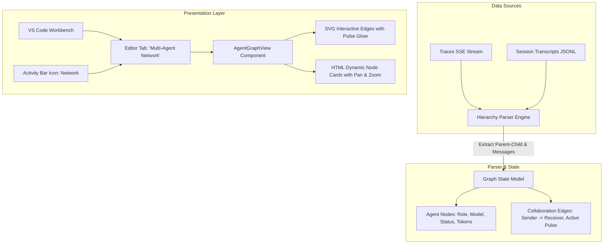

# Thiết Kế Kỹ Thuật AGMon: Multi-Agent Collaboration DAG Graph

**Ngày tạo:** 2026-10-08  
**Dự án:** `agmon` (Agent Factory & Monitor)  
**Phiên bản mục tiêu:** `v0.3.5`  
**Trạng thái:** Đã phê duyệt thiết kế (Ready for Implementation)  

---

## 1. Tóm Tắt & Mục Tiêu

Tính năng **Multi-Agent Collaboration DAG Graph** nâng cấp AGMon từ việc chỉ quan sát các bàn làm việc đơn lẻ thành một **hệ thống trực quan hóa mạng lưới quan hệ đa tác nhân (Multi-Agent Network & Hierarchy)** theo thời gian thực.

### Giá trị mang lại:
1. **Làm rõ cấu trúc phân rã công việc**: Nhìn thấy ngay Agent cha (Orchestrator / Main session) đã ủy thác các tác vụ nào cho Agent con (Subagents: Researcher, Coder, Reviewer, Image Generator...).
2. **Trực quan hóa luồng dữ liệu thời gian thực**: Đường truyền Bezier cong mềm mại giữa các Agent phát xung nhịp dữ liệu (SVG data-packet animation) mỗi khi có thông điệp hoặc kết quả được gửi đi.
3. **Điều hướng nhanh 1-Click**: Bấm vào bất kỳ node nào trong đồ thị để mở ngay cửa sổ Inspector hoặc hội thoại chat chi tiết của đúng Subagent đó.
4. **Hiệu năng siêu nhẹ (KISS)**: Sử dụng động cơ **Native SVG/HTML Canvas**, 0 thư viện bên ngoài, tương thích tuyệt đối 100% với Next.js 16 và React 19.

---

## 2. Kiến Trúc Hệ Thống & Thành Phần Kỹ Thuật

---

## 3. Chi Tiết Triển Khai Kỹ Thuật

### 3.1. Thuật toán Sắp xếp Phân tầng Tự động (Hierarchical DAG Layout)
- **Tầng 0 (Root Level)**: Session chính (Orchestrator / CLI Session).
- **Tầng 1 (Specialist Subagents)**: Các agent con được gọi qua `invoke_subagent` hoặc spawn độc lập cùng workspace.
- **Tầng 2+ (Sub-subagents)**: Các agent chuyên trách sâu hơn (nếu có phân rã nhiều tầng).
- **Tự động cân bằng vị trí (Auto-centering & Spacing)**: Tính toán toạ độ `(x, y)` cho từng node dựa trên số lượng nhánh con để các đường nối không bị đè lên nhau.

### 3.2. Động cơ Dựng hình Native SVG/HTML (0 Dependency)
- **Component:** `src/components/factory/AgentGraphView.jsx`
- **Đường liên kết (Edges)**:
  - Sử dụng thẻ `<path d="M x1 y1 C cx1 cy1, cx2 cy2, x2 y2" />` với đường cong Cubic Bezier thanh thoát.
  - Hiệu ứng xung nhịp: Khi node con đang ở trạng thái `running` hoặc vừa nhận message, kích hoạt hiệu ứng CSS `stroke-dashoffset` làm sáng đường dẫn như dòng điện chạy trong bo mạch.
- **Thẻ Agent Node (HTML DOM Nodes)**:
  - Header: Icon Avatar robot (tô màu theo role của agent), Role title, Type badge.
  - Body: Model badge (`pro`, `flash`, `minimax`), Task prompt tóm tắt (2 dòng), trạng thái `streaming`, `done`, `idle`, `error`.
  - Footer: Số token tiêu thụ, số lượng công cụ đã thực thi, nút xem Live Chat.
- **Bộ điều khiển Pan & Zoom**:
  - Hỗ trợ kéo chuột để di chuyển không gian đồ thị (Pan).
  - Phóng to / Thu nhỏ mượt mà bằng con lăn chuột hoặc nút bấm Zoom (+/-), nút "Fit to Screen" căn giữa toàn bộ mạng lưới.

### 3.3. Tích hợp Workbench
1. **Activity Bar (`src/components/layout/ActivityBar.jsx`)**:
   - Thêm nút chuyển đổi tab **Agent Network** (dùng icon `GitFork` / `Network` từ `lucide-react`).
2. **Editor Tabs (`src/components/layout/EditorTabs.jsx`)**:
   - Hỗ trợ tab `network` cạnh `office` và `tokens`.
3. **VS Code Workbench (`src/components/layout/VSCodeWorkbench.jsx`)**:
   - Khi tab `network` được chọn, render `<AgentGraphView />` chiếm trọn khung làm việc trung tâm.

---

## 4. Tiêu Chuẩn Thiết Kế & Quy Tắc Bắt Buộc

- **Icon & UI Standard**: Tuyệt đối không sử dụng raw unicode emoji/symbol trong giao diện UI; 100% sử dụng icon component chuẩn từ `lucide-react`.
- **Theme thống nhất**: Bảng màu Dark Slate (`slate-950`, `slate-900`, `slate-800`), điểm nhấn Cyan (`#38bdf8`), Indigo (`#6366f1`) và Emerald (`#10b981`).
- **Performance**: Render thuần DOM + SVG vector, không gây giật lag khi có 10-20 agents cùng xuất hiện trên đồ thị.

---

## 5. Kế Hoạch Các Bước Thực Hiện Tiếp Theo

1. **Phase 1**: Xây dựng thuật toán phân tích cây quan hệ `extractAgentHierarchy(traces, sessions)` trích xuất danh sách nodes & edges.
2. **Phase 2**: Xây dựng component `AgentGraphView.jsx` với SVG Bezier curves, pulse animation, node layout và pan/zoom viewport.
3. **Phase 3**: Gắn kết vào `ActivityBar`, `EditorTabs`, `VSCodeWorkbench` và kết nối sự kiện click node để mở `SessionChatModal`.
4. **Phase 4**: Kiểm thử biên dịch, build Turbopack và kiểm thử tự động với trình duyệt.
