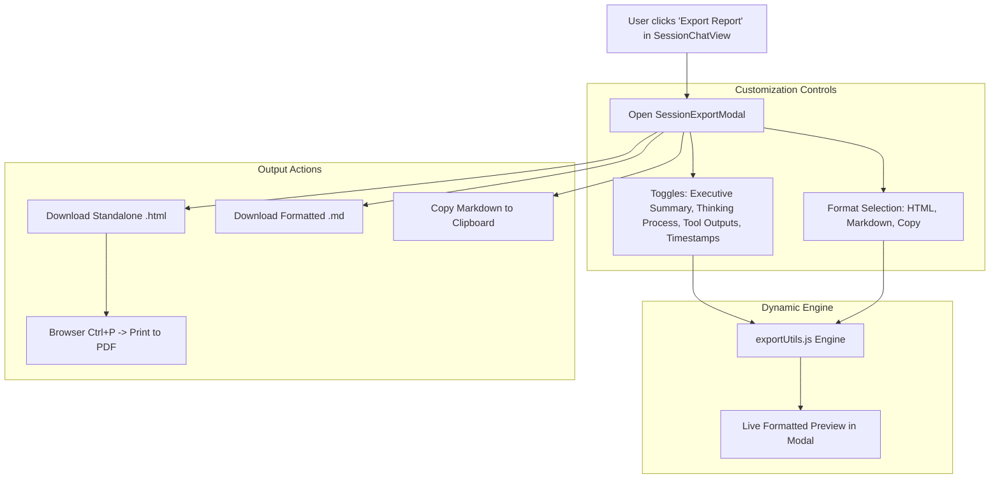

# Technical Design: AGMon Session Report & Export Hub

**Creation Date:** 2026-10-08  
**Project:** `agmon` (Agent Factory & Monitor)  
**Target Version:** `v0.4.5`  
**Status:** Approved by User (Ready for /ck:plan)  

---

## 1. Executive Summary & Problem Statement

Currently, AGMon has a basic `exportMarkdown` callback in `SessionChatView` that triggers an immediate download of a raw Markdown text file. 
However, developers and teams using AGMon require a comprehensive, shareable, and well-structured report for:
1. **Executive reporting**: Providing clients, managers, or teammates with clean summaries of AI tasks, token costs, and deliverables without exposing raw, confusing internal agent logs.
2. **Pull Request / Ticket documentation**: 1-click copying of session summaries and file changes directly into GitHub PRs, Jira tickets, or Slack messages.
3. **Offline archiving & PDF printing**: Exporting self-contained, stylish HTML reports with dark mode that can be opened anywhere without a server and printed to PDF via standard browser print (`Ctrl+P` / `Cmd+P`).

---

## 2. Architecture & Presentation Workflow

---

## 3. Technical Specifications

### 3.1. Dedicated Modal: `SessionExportModal.jsx`
- **Location**: `src/components/chat/SessionExportModal.jsx`
- **UI Structure**:
  - **Header**: Title "Export Session Report", session ID badge, close button.
  - **Left Sidebar / Options Panel**:
    - **Format Selector**: Segmented control for `Standalone HTML`, `Markdown (.md)`.
    - **Content Toggles**:
      - `Executive Summary` (Session metadata, model, runtime, tokens, cost)
      - `Include Thinking Process` (Show/hide internal thought blocks)
      - `Include Tool Outputs` (Show/hide verbose outputs of tool calls)
      - `Include Timestamps` (Show/hide turn-level timestamps)
  - **Right Panel / Live Preview**:
    - Embedded scrollable preview box showing the rendered document in real-time as toggles change.
  - **Footer Action Bar**:
    - `Copy to Clipboard` button (with quick "Copied!" feedback state).
    - `Download [Format]` button with corresponding file icon.

### 3.2. Pure Export Engine: `exportUtils.js`
- **Location**: `src/lib/exportUtils.js`
- **Functions**:
  - `generateSessionMarkdown(sessionData, options)`: Returns structured GitHub Flavored Markdown string.
  - `generateSessionHtml(sessionData, options)`: Generates self-contained HTML document with:
    - Inline modern dark CSS styling matching AGMon.
    - Responsive card layouts for User Prompts, AI Thinking, Tool Calls, and Assistant Answers.
    - `@media print` CSS block that strips background tints, sets clean high-contrast text, forces page breaks before major headers, and optimizes margins for Letter/A4 PDF generation.

### 3.3. Integration in `SessionChatView.js`
- Replace direct `exportMarkdown` download trigger on the header button with `setIsExportModalOpen(true)`.
- Pass current `session` and `turns` data into `SessionExportModal`.

---

## 4. UI/UX Rules & Constraints Compliance
- **100% English UI**: All labels, tooltips, buttons, and generated report templates are in English.
- **Zero Raw Unicode Emojis**: All visuals use standard `lucide-react` icons (`FileText`, `Code`, `Copy`, `Download`, `Printer`, `Check`, `Settings2`, `SlidersHorizontal`).
- **No External Network Dependencies**: HTML export is 100% self-contained (no external CDN links for CSS or fonts, works offline).
