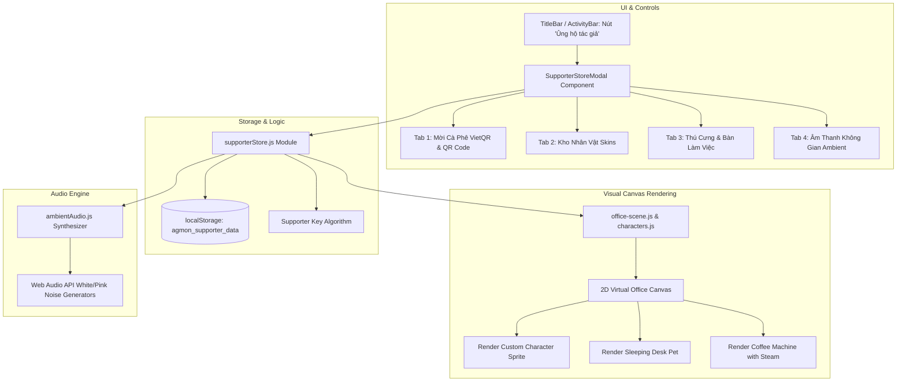

# Thiết Kế Kỹ Thuật AGMon: Supporter Store & Cosmetic Desk Customization

**Ngày tạo:** 2026-10-08  
**Dự án:** `agmon` (Agent Factory & Monitor)  
**Phiên bản mục tiêu:** `v0.4.0`  
**Trạng thái:** Đã phê duyệt thiết kế (Ready for Planning)  

---

## 1. Tóm Tắt & Mục Tiêu

Tính năng **Supporter Store (Tiệm Cà Phê Văn Phòng & Kho Phụ Kiện)** cung cấp một kênh ủng hộ / donate tài chính văn minh, thân thiện dành cho các lập trình viên sử dụng AGMon, mang lại trải nghiệm cá nhân hóa không gian làm việc thú vị (Gamification & Delight) mà không khóa bất kỳ tính năng kỹ thuật cốt lõi nào.

### Các giá trị mang lại:
1. **Kênh Donate Trực Tiếp 0% Phí (VietQR & Quốc Tế)**: Tạo mã QR ngân hàng Việt Nam tự động (VietQR.io) với các gói mời cà phê linh hoạt (20k, 50k, 100k) cùng các liên kết Buy Me a Coffee / GitHub Sponsors.
2. **Cá nhân hóa Nhân vật (Character Skins)**: Thay đổi hình ảnh robot mặc định bằng các skin độc quyền: *Pixel Cat Coder* (chú mèo gõ phím), *Cyber Ninja* (mắt laser neon), *Retro Hacker* (hoodie trùm đầu).
3. **Thú cưng & Phụ kiện Bàn làm việc (Pets & Desk Props)**: Chú chó Shiba hoặc mèo con ngủ dưới gầm bàn; máy pha cà phê Espresso mini bốc khói mỗi khi Agent chạy lệnh; chậu cây xanh thư giãn.
4. **Âm thanh Không gian (Ambient Soundscapes)**: Tích hợp bộ tạo âm thanh mưa rơi, tiếng quán cà phê ấm cúng bằng Web Audio API thuần (0 byte file nhạc ngoài).
5. **Cơ chế Kích hoạt Đơn giản (KISS)**: Sử dụng mã Supporter Key lưu trong `localStorage`, không cần máy chủ xác thực tài khoản phức tạp.

---

## 2. Kiến Trúc Hệ Thống



---

## 3. Chi Tiết Triển Khai Kỹ Thuật

### 3.1. Quản lý Kho Đồ & Trạng Thái Trang Bị (`src/lib/supporterStore.js`)
- **Dữ liệu lưu trữ:**
  ```js
  {
    isSupporter: boolean,
    supporterTier: "none" | "coffee" | "meal" | "vip",
    equippedSkin: "classic" | "cat" | "ninja" | "hacker",
    equippedPet: "none" | "cat" | "shiba",
    equippedProps: ["coffee_machine", "bonsai", "rgb_keyboard"],
    ambientSound: "none" | "rain" | "coffee_shop",
    unlockedItems: string[]
  }
  ```
- **Thuật toán Supporter Key (Offline Validator):**
  - Cung cấp cơ chế mở khóa bằng mã Supporter Code (ví dụ: `AGMON-COFFEE-VIP`, `SUPPORTER-2026`, hoặc các mã hash tạo ra tự động) để mở khóa toàn bộ kho đồ ngay lập tức mà không cần kết nối server.

### 3.2. Tiệm Cà Phê & Giao Diện Kho Đồ (`src/components/store/SupporterStoreModal.jsx`)
- **Giao diện Tab 1 (Donate VietQR)**:
  - Chọn mức ủng hộ:
    - **Ly Cà Phê Sữa** (20,000 VNĐ / $1)
    - **Bữa Trưa Lập Trình Viên** (50,000 VNĐ / $2.5)
    - **Gói Buff Đêm Dev VIP** (100,000 VNĐ / $5)
  - Hiển thị mã QR ngân hàng tự động kèm số tài khoản, tên ngân hàng và cú pháp nội dung.
  - Khung nhập mã kích hoạt (Unlock Code) kèm nút kích hoạt.
- **Giao diện Tab 2 (Kho Nhân Vật)**:
  - Danh sách thẻ Card hình nhân vật (Pixel preview).
  - Nút "Trang bị" (Equip) / "Đang dùng" (Equipped) / "Mở khóa".
- **Giao diện Tab 3 (Thú cưng & Bàn làm việc)**:
  - Tùy chọn bật/tắt thú cưng nằm dưới bàn của Agent.
  - Tùy chọn máy pha cà phê bốc khói / cây cảnh trên bàn.
- **Giao diện Tab 4 (Âm thanh Không gian Ambient)**:
  - Nút bật/tắt tiếng mưa rơi rả rích, quán cà phê với thanh trượt âm lượng riêng biệt.

### 3.3. Dựng Hình Đồ Họa Trên Canvas (`characters.js` & `office-scene.js`)
- **Vẽ Skin Nhân Vật**:
  - `cat`: Vẽ đầu mèo tai nhọn, mắt híp, chân bấm bàn phím.
  - `ninja`: Mắt kính laser màu xanh neon phát sáng, khăn choàng phất phơ.
  - `hacker`: Mũ trùm hoodie màu xám đậm viền xanh lá matrix.
- **Vẽ Thú Cưng**:
  - Đặt dưới chân bàn làm việc của Workstation: Sprite mèo con hoặc chú chó Shiba đang cuộn tròn thở nhẹ nhàng (hiệu ứng co giãn hô hấp 2 frame pixel).
- **Vẽ Phụ Kiện Bàn**:
  - Máy cà phê mini đặt trên góc bàn, mỗi khi agent ở trạng thái `streaming` thì xuất hiện các hạt khói trắng nhỏ bay lên.

### 3.4. Bộ Sinh Âm Thanh Ambient Bằng Web Audio API (`src/lib/ambientAudio.js`)
- **Tiếng mưa (Rain Ambience)**:
  - Dùng bộ sinh nhiễu hồng (Pink Noise) lọc qua dải thông thấp (Lowpass Filter ~800Hz) tạo cảm giác mưa rào nhẹ ngoài cửa sổ.
- **Tiếng quán cà phê (Coffee Shop Ambience)**:
  - Dùng bộ lọc Bandpass dao động nhẹ tạo tiếng thì thầm và âm thanh ấm cúng của quán cà phê lo-fi.

---

## 4. Tiêu Chuẩn Thiết Kế & Quy Tắc

- **Icon & UI Standard**: Tuyệt đối không sử dụng ký tự unicode symbol/emoji thô trong giao diện UI; 100% sử dụng icon chuẩn từ `lucide-react` (`Coffee`, `Heart`, `Sparkles`, `Cat`, `Shield`, `Volume2`, `Gift`...).
- **KISS & YAGNI**: Không cần tích hợp payment gateway phức tạp; dùng VietQR ảnh chuẩn + Local Storage Key để giữ app độc lập, nhẹ và an toàn.
- **Hiệu năng Canvas**: Các hoạt họa phụ kiện và thú cưng vẽ bằng Pixi Graphics / HTML5 Canvas siêu nhẹ, đảm bảo 60 FPS mượt mà.
