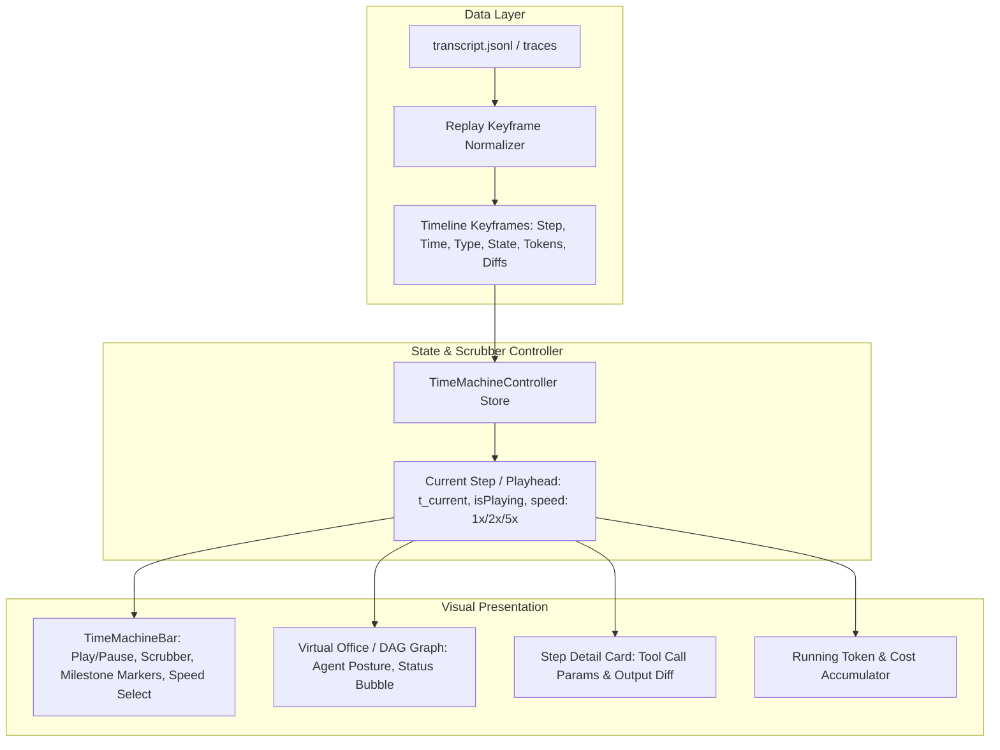

# Thiết Kế Kỹ Thuật AGMon: Time-Machine Session Replay (Tua Lại Diễn Biến Hoạt Động Agent)

**Ngày tạo:** 2026-10-08  
**Dự án:** `agmon` (Agent Factory & Activity Visualizer)  
**Phiên bản mục tiêu:** `v0.4.0`  
**Trạng thái:** Đang Brainstorm & Lấy Ý Kiến Kiến Trúc  

---

## 1. Phân Tích Problem-First (8 Khía Cạnh Cốt Lõi)

### 1.1. Solution-jumping diagnosis (Chẩn đoán nguyên nhân thúc đẩy)
- **Tín hiệu nảy sinh giải pháp:** Sau khi agent chạy xong 1 phiên dài (15-45 phút), người dùng mở Session Chat hoặc Terminal logs thì chỉ thấy một cuộn text khổng lồ hàng nghìn dòng.
- **Nỗi đau tiềm ẩn:** Rất khó trả lời các câu hỏi: *"Agent đã đưa ra quyết định sai ở bước nào?", "Tại sao token đột ngột tăng vọt ở phút thứ 12?", "Tại thời điểm nào file bị sửa lỗi?". Người dùng bị mất đi **ngữ cảnh không-thời gian (spatial-temporal context)** của phiên làm việc.

### 1.2. Vấn đề gốc rễ (Underlying problem)
- Dữ liệu lịch sử hiện tại chỉ tồn tại dưới dạng **bản ghi tĩnh (Static post-mortem log)**. Thiếu một cơ chế **tái hiện động (Dynamic historical reproduction)** cho phép người dùng quan sát tuần tự từng hành vi, luồng suy nghĩ và thao tác công cụ của Agent như đang xem một cuốn băng video.

### 1.3. Thách thức các giả định (Assumption challenges)
1. *Giả định 1: Cần xuất ra file video MP4 thực tế.*  
   -> **Sai lầm:** Render video MP4 tiêu tốn tài nguyên CPU/GPU khổng lồ, không tương tác được vào code/diff bên trong.  
   -> **Thực tế:** Chỉ cần **Virtual Event Scrubber** điều khiển trạng thái ảo (virtual state) trên UI.
2. *Giả định 2: Mọi session đều có thể replay với 60fps mượt mà.*  
   -> **Rủi ro:** Một transcript có thể chứa 200+ tool calls và hàng triệu tokens. Nếu render lại DOM liên tục sẽ gây giật lag.  
   -> **Giải pháp:** Phân mảnh theo **Keyframe Milestones** (Chỉ nhảy qua các sự kiện chính: Suy nghĩ -> Gọi tool -> Sửa file -> Chạy lệnh -> Hoàn tất).

### 1.4. Tuyên ngôn bài toán (Problem statement)
- **Đối tượng bị ảnh hưởng:** Lập trình viên / AI Engineer vận hành Antigravity CLI, Claude Code.
- **Điểm nghẽn:** Không thể review nhanh và trực quan quá trình giải quyết bài toán của AI Agent; phải đọc thủ công từng bước JSONL.
- **Hậu quả:** Khó debug prompt, khó phát hiện các tool call lãng phí hoặc các đoạn code bị ghi đè ngoài ý muốn.
- **Đo lường thành công:** Người dùng có thể kéo thanh trượt (Scrubber) hoặc bấm Play để xem lại toàn bộ hành trình của Agent từ bước 0 đến bước kết thúc trong dưới 60 giây.

### 1.5. Ba góc nhìn định hình giải pháp (Alternative framings)
- **Frame A (Trình phát Timeline độc lập):** Tạo một tab/modal riêng có thanh điều khiển Play/Pause/Scrub và danh sách Step Card chạy tuần tự.
- **Frame B (Unified Office Canvas Replay - Khuyên dùng):** Thanh điều khiển Time-Machine nằm đè lên Canvas Văn Phòng hoặc Network Graph. Khi bấm Play hoặc kéo chuột tua thời gian, nhân vật Agent trên bàn làm việc thực sự đổi trạng thái, bóng thoại nổi lên, và thanh token tích luỹ tương ứng đúng thời điểm đó.
- **Frame C (Git Time-Travel Debugger):** Tích hợp với Git commit tree để tua lại cây mã nguồn theo từng lệnh git của agent.

### 1.6. Trạng thái bằng chứng (Evidence status)
- **Strong (Mạnh mẽ):** Dữ liệu transcript `.system_generated/logs/transcript.jsonl` đã có sẵn đầy đủ timestamp, tool calls, message content và token usage cho từng bước. Endpoint `/api/sessions/[id]/transcript` đã sẵn sàng hoạt động.

### 1.7. Kế hoạch kiểm chứng (Validation plan)
- Kiểm tra trực tiếp trên các transcript thực tế của Antigravity CLI và Claude Code.
- Thử nghiệm hiệu năng với session dài 150+ steps xem việc kéo tua thời gian có đạt phản hồi < 16ms (60fps) không.

### 1.8. Thông điệp thống nhất (Stakeholder message)
> *"Tính năng Time-Machine Replay không chỉ là thanh trượt xem lại log, mà là một bước nhảy vọt biến AGMon thành một 'Flight Blackbox Recorder' (Hộp đen hành trình) cho AI Agent: trực quan, sinh động và hỗ trợ đắc lực cho việc tối ưu hoá hành vi của Agent."*

---

## 2. Kiến Trúc Kỹ Thuật Đề Xuất (Architecture & Components)



### 2.1. Cấu trúc Keyframe Sự Kiện (Keyframe Event Model)
Mỗi bước trong transcript được chuẩn hoá thành một sự kiện trên trục thời gian:
```javascript
{
  stepIndex: 12,
  timestamp: "2026-10-08T09:45:10Z",
  elapsedSeconds: 142, // Giây thứ 142 tính từ lúc bắt đầu session
  type: "tool_call",  // 'user_input' | 'thought' | 'tool_call' | 'tool_result' | 'file_write' | 'error' | 'finish'
  agentState: "busy", // 'idle' | 'busy' | 'streaming' | 'error' | 'done'
  title: "Chạy lệnh kiểm tra build: npm run build",
  details: {
    toolName: "run_command",
    params: { CommandLine: "npm run build" },
    resultPreview: "Compiled successfully in 1.4s"
  },
  cumulativeTokens: 45200,
  cumulativeCost: 0.045
}
```

### 2.2. Các Thành Phần Giao Diện (UI Controls)
Sử dụng 100% Shared UI từ [`src/components/ui/`](file:///Volumes/T9/Projects/agent-factory/src/components/ui/):
1. **`TimeMachineToolbar` (Thanh điều khiển cố định dưới chân Canvas / Tab):**
   - **Nút Play / Pause** (`Button` icon `Play` / `Pause`).
   - **Tốc độ phát** (`Select`: 1x, 2x, 5x, 10x).
   - **Step Forward / Backward** (`Button` icon `SkipBack`, `SkipForward`).
   - **Timeline Scrubber (Thanh trượt dải thời gian):**
     - Đánh dấu các mốc Milestone bằng màu sắc:
       - Xanh ngọc (`cyan`): Tool calls
       - Xanh lá (`emerald`): Hoàn thành / Test passed
       - Vàng hổ phách (`amber`): User input / Prompts
       - Đỏ (`rose`): Lỗi / Error
     - Đầu đọc (Playhead cursor) có thể kéo thả chuột tức thì.
2. **`ReplayEventInspector` (Cửa sổ chi tiết bước đang phát):**
   - Hiển thị tool call, parameters, output và file diff tương ứng với bước đó.
3. **Phím tắt điều khiển nhanh (Keyboard Shortcuts):**
   - `Space`: Play / Pause
   - `ArrowLeft` / `ArrowRight`: Lùi / Tiến 1 bước
   - `Shift + ArrowLeft/Right`: Nhảy đến mốc Tool Call trước / sau
   - `Home` / `End`: Về đầu / Về cuối phiên

---

## 3. Các Phương Án Triển Khai (Approaches Comparison)

| Tiêu Chí | Phương Án 1: Standalone Replay Modal | Phương Án 2: Unified Canvas/Tab Overlay (Khuyên dùng) | Phương Án 3: Dedicated Fullpage Studio |
| :--- | :--- | :--- | :--- |
| **Cách thức** | Mở một Modal popup riêng biệt để xem lại | Thanh điều khiển Time-Machine gắn trực tiếp vào Editor Tab của Workbench | Một trang riêng biệt `/replay/[id]` tách rời Workbench |
| **Độ mượt mà** | Độc lập, dễ làm nhưng rời rạc | **Tích hợp liền mạch vào VS Code Workbench**, gắn kết trực tiếp với Canvas & Inspector | Tách rời layout hiện tại |
| **Đồng bộ không gian**| Chỉ xem được dạng danh sách sự kiện | **Nhân vật Agent trên Canvas thực sự đổi dáng điệu/bóng thoại** theo thời gian | Cần duplicate lại layout |
| **Khối lượng code** | Nhỏ (~400 dòng) | **Vừa phải (~600 dòng)**, tái sử dụng Canvas/Graph có sẵn | Lớn (>1200 dòng) |
| **Đánh giá** | Tạm chấp nhận | **Tối ưu nhất (KISS + UX đỉnh cao)** | Over-engineering |

---

## 4. Quyết Định Thiết Kế & Quy Chuẩn (Rules & Constraints)
- **Quy tắc UI**: Tuyệt đối không dùng symbol emoji thô. 100% sử dụng Lucide React (`Play`, `Pause`, `RotateCcw`, `FastForward`, `Clock`, `Sliders`).
- **Shared Components**: Sử dụng toàn bộ `Button`, `Input`, `Select`, `Badge`, `Tooltip` từ `@/components/ui`.
- **Hiệu năng**: Sử dụng `requestAnimationFrame` và tính toán trước mảng `keyframes` một lần duy nhất lúc tải session để thao tác tua (scrubbing) đạt 60fps mượt mà, không giật lag.
