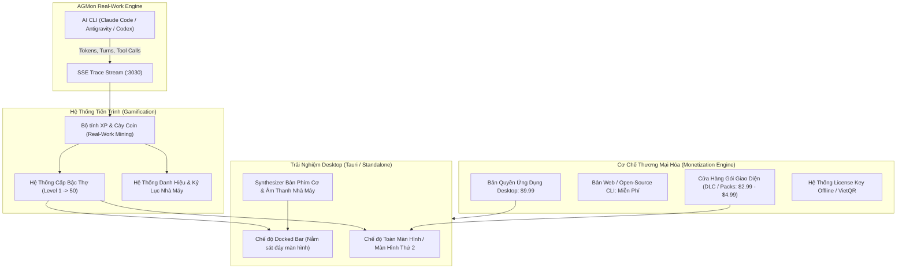

# Thiết Kế Chiến Lược: Biến AGMon Thành "Nhà Máy AI" Vui Nhộn & Kiếm Tiền (Gamified Desktop Companion)

**Ngày lập:** 2026-10-09  
**Dự án:** `agmon` (Agent Factory & Monitor)  
**Mục tiêu:** Kết hợp mô hình **Desktop App Companion** ($9.99) và **Hệ thống Tiến trình Level Thợ (XP / Progression)** cùng **Cửa hàng Decor Skin (DLC Cosmetics)**.  
**Tham chiếu thị trường thành công:** *Rusty's Retirement* ($3.5M+ doanh thu), *Spirit City: Lofi Sessions* ($5.3M+ doanh thu), *Screeps*, *Pixel Agents*.

---

## 1. Problem-First: Tại Sao Sản Phẩm Này Có Thể Thắng Lớn?

### 1.1. Nỗi đau thực tế của Lập trình viên chạy AI Agent
- **Terminal Fatigue (Hội chứng kiệt sức vì màn hình đen)**: Lập trình viên hiện đại chạy Claude Code, Antigravity CLI, OpenAI Codex suốt 6-10 tiếng mỗi ngày. Các cửa sổ terminal đen kịt chỉ có chữ chạy ùn ùn gây cảm giác nặng nề, căng thẳng và cô đơn.
- **Hộp đen vô cảm**: Khi agent chạy một tác vụ dài mất 5-10 phút, dev không biết agent đang làm gì, không có phản hồi trực quan, và khi xong việc chỉ có một dòng chữ khô khốc.
- **Thiếu cảm giác thành tựu (Dopamine Deficit)**: Dù agent đã viết hàng nghìn dòng code và giải quyết xong tính năng lớn, dev không nhận được bất kỳ "phần thưởng cảm xúc" nào.

### 1.2. Lợi thế cốt lõi độc nhất của AGMon (The Unfair Advantage)
- Các game idle giả lập thông thường (như *Rusty's Retirement*) chỉ là mô phỏng ảo, chơi vài tuần sẽ chán vì không tạo ra giá trị đời thực.
- **AGMon gắn trực tiếp với CÔNG VIỆC THẬT (Real-Work Mining)**:
  - Agent pixel gõ phím đúng lúc Claude/Antigravity đang suy nghĩ và gõ code thật.
  - Hạt token bay thật từ bàn làm việc sang Server Hub và Pod Gemini/Claude/OpenAI.
  - Mỗi dòng code thật được sửa = Điểm kinh nghiệm (XP) thật = Còi nhà máy thật reo vang ăn mừng!

---

## 2. Kiến Trúc Tổng Thể: 3 Trụ Cột Cốt Lõi

---

## 3. Chi Tiết Tính Năng

### 3.1. Trụ Cột 1: Trải Nghiệm Desktop Companion (Docked Mode)
- **Đóng gói công nghệ**: Sử dụng **Tauri 2.0** (Rust + Webview), dung lượng bộ cài siêu nhẹ (< 15MB, RAM < 40MB), chạy mượt 60fps trên cả macOS, Windows và Linux.
- **2 Chế độ hiển thị linh hoạt**:
  1. **Docked Bar (Kiểu *Rusty's Retirement*)**: Một thanh dài cao khoảng 100px - 140px nằm gọn gàng ở cạnh dưới hoặc cạnh trên màn hình. Trong khi dev gõ VS Code, các chú thợ pixel vẫn chạy đi chạy lại bê token và sửa code ở ngay mép dưới màn hình.
  2. **Full Factory Mode**: Mở toàn màn hình cho màn hình phụ (Second Monitor), hiển thị toàn bộ 20 bàn làm việc, tủ Rack Core Hub, ống khói nhà máy và các Pod AI Cloud khổng lồ.
- **Luôn nổi (Always-On-Top)** & Click-Through: Có thể bật chế độ bán trong suốt, bấm xuyên qua để không cản trở thao tác lập trình.

### 3.2. Trụ Cột 2: Hệ Thống Tiến Trình Level Thợ (Work-to-Earn XP)
Biến việc lập trình hằng ngày thành một tựa game nhập vai công sở:
- **Công thức tính XP**:
  - `+1 XP` cho mỗi 100 token do AI sinh ra.
  - `+25 XP` cho mỗi tool execution thành công (chạy test, đọc file, gọi API).
  - `+100 XP` cho mỗi Git Commit / Task hoàn thành.
  - `+500 XP` khi vượt qua bài test kiểm thử phức tạp.
- **Hệ thống Cấp Bậc Thợ Nhà Máy**:
  - **Level 1 - 4**: *Thợ Học Việc (Intern Apprentice)* - Bàn làm việc bằng gỗ mộc đơn sơ, đèn bàn dầu.
  - **Level 5 - 9**: *Thợ Bậc Ba (Junior Craftsman)* - Màn hình CRT cổ điển, cốc cà phê giấy.
  - **Level 10 - 19**: *Kỹ Sư Lành Nghề (Senior Artificer)* - 2 màn hình LED, ghế công thái học, bàn phím cơ.
  - **Level 20 - 39**: *Quản Đốc Phân Xưởng (Factory Overseer)* - Bàn làm việc phòng kính, tủ sách kỹ thuật, máy pha cà phê Espresso.
  - **Level 40 - 50**: *Đại Sư Tự Động Hóa (Automation Archmage)* - Ngai vàng Cyberpunk lơ lửng, màn hình ba chiều hologram.
- **Đồng tiền trong game ($WATT / $COIN)**: Cày được từ code thật, dùng để mở khóa các đồ trang trí cơ bản miễn phí trong cửa hàng (cây kim ngân, lịch treo tường, mèo ngủ dưới chân).

### 3.3. Trụ Cột 3: Cửa Hàng Decor & DLC (The Monetization Store)
Học hỏi từ gói Supporter Pack của *Rusty's Retirement* (doanh số $110k+ chỉ từ 1 skin vàng):
- **Phân loại hàng hóa trong Shop**:
  1. **Chủ đề Nhà máy (Factory Themes - $4.99/pack)**:
     - *Cyberpunk Neo-Tokyo*: Văn phòng ống thép, ánh sáng tím neon rực rỡ, đường ray chở token như xe điện ngầm.
     - *Silicon Valley 1984 Garage*: Nhà để xe cổ điển, máy tính Macintosh 128k màu be, máy in kim kêu rè rè.
     - *Quán Cafe Tokyo Ngày Mưa*: Cửa kính đọng nước mưa, nhạc lofi jazz, tiếng pha chế cà phê ấm cúng.
     - *Trạm Không Gian Sao Hỏa (Mars Space Colony)*: Cửa sổ nhìn ra ngoài vũ trụ, robot lơ lửng chống trọng lực.
  2. **Gói Âm Thanh Bàn Phím Cơ (Mechanical Keyboard Soundpacks - $2.99/pack)**:
     - Tiếng gõ switch Cherry MX Blue (Clicky sướng tai).
     - Tiếng gõ switch Topre êm ái.
     - Tiếng bàn phím máy tính cổ IBM Model M (Thocky & Clacky).
     - *Cơ chế đặc biệt*: Tốc độ gõ phím cơ trên loa đồng bộ 100% với tốc độ sinh token của Gemini / Claude / GPT theo thời gian thực!
  3. **Skin Nhân Vật & Thú Cưng ($1.99 - $3.99)**:
     - Mèo Lập Trình Viên (gõ phím bằng 2 chân trước).
     - Robot Gundam mini bê tài liệu.
     - Chú chó Corgi / Shiba chạy lăng xăng nhặt hạt token rớt trên sàn.

---

## 4. Chiến Lược Giá & Kênh Bán Hàng

| Sản phẩm | Mức giá | Kênh phân phối | Mục đích |
|---|---|---|---|
| **AGMon CLI / Web Viewer** | **Miễn phí (MIT/Open Source)** | npm, GitHub | Thu hút cộng đồng lập trình viên toàn cầu sử dụng, tạo hiệu ứng truyền miệng |
| **AGMon Desktop Edition** | **$9.99 (Mua đứt trọn đời)** | Steam, Gumroad, Website | Chế độ Docked Bar, Always-On-Top, chạy nền cực nhẹ, tự động kích hoạt cùng OS |
| **DLC Cosmetic Theme Packs** | **$2.99 - $4.99 / gói** | Steam DLC, Web Store (Stripe/VietQR) | Doanh thu định kỳ từ nhóm lập trình viên đam mê decor góc làm việc |
| **Gói All-In-One Founder Pack** | **$24.99** | Steam / Web | Bản Desktop + Toàn bộ 5 theme + Huy hiệu Founder vĩnh viễn trên bàn làm việc |

---

## 5. Lộ Trình Triển Khai Thực Tế (Phased Roadmap)

### Giai đoạn 1: Đưa Gamification & Soundboard vào bản Web hiện tại (v0.6.0)
- Tích hợp bộ tính XP và Level Thợ ngay trong file `traceContract.js` và `office-scene.js`.
- Bổ sung hiệu ứng lên cấp (Level Up animation) rực rỡ khi agent cày xong 1 task lớn.
- Bổ sung Web Audio Synthesizer phát tiếng lách cách bàn phím cơ theo tốc độ token streaming (dùng Web Audio API thuần, 0 byte file rác).

### Giai đoạn 2: Supporter Store & Trang Bị Skin Bàn Ghế (v0.7.0)
- Mở rộng `src/lib/supporterStore.js` để lưu trữ $COIN cày được và danh sách skin đã mở khóa.
- Dựng giao diện Modal Tiệm Đồ Chơi Nhà Máy (Factory Storefront).
- Tích hợp cổng thanh toán trực tiếp (VietQR tự động + Stripe/Polar Checkout).

### Giai đoạn 3: Đóng gói Tauri Desktop & Ra Mắt Steam / Gumroad (v1.0.0)
- Tạo khung Tauri bao bọc giao diện Next.js/Static Export.
- Tối ưu chế độ Docked Bar (thu nhỏ cửa sổ xuống mép dưới màn hình).
- Đăng ký Steamworks, tạo trang Steam Store với video gameplay vui nhộn để hút wishlist.

---

## 6. Tiêu Chí Đo Lường Thành Công (Success Metrics)
1. **Mức độ gắn kết (Stickiness)**: Tỷ lệ người dùng mở AGMon liên tục > 4 tiếng/ngày trong lúc làm việc.
2. **Tỷ lệ chuyển đổi mua hàng (Conversion Rate)**: Đạt từ 5% - 10% người dùng miễn phí nâng cấp lên bản Desktop hoặc mua Supporter Pack.
3. **Hiệu ứng Lan Truyền (Viral Loop)**: Dev chụp ảnh/video quay lại góc màn hình đáy có chú thợ pixel đang cày task để khoe trên X (Twitter), Reddit r/unixporn, LinkedIn và TikTok.
