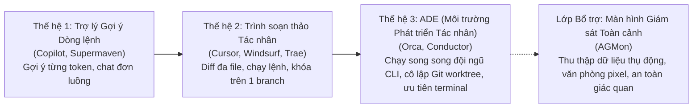
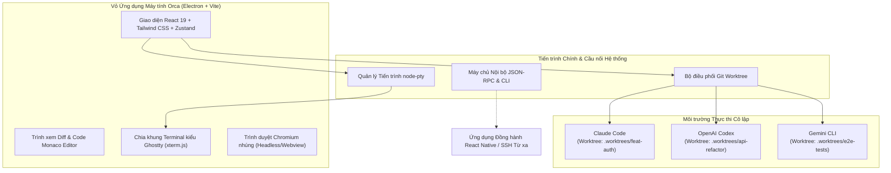
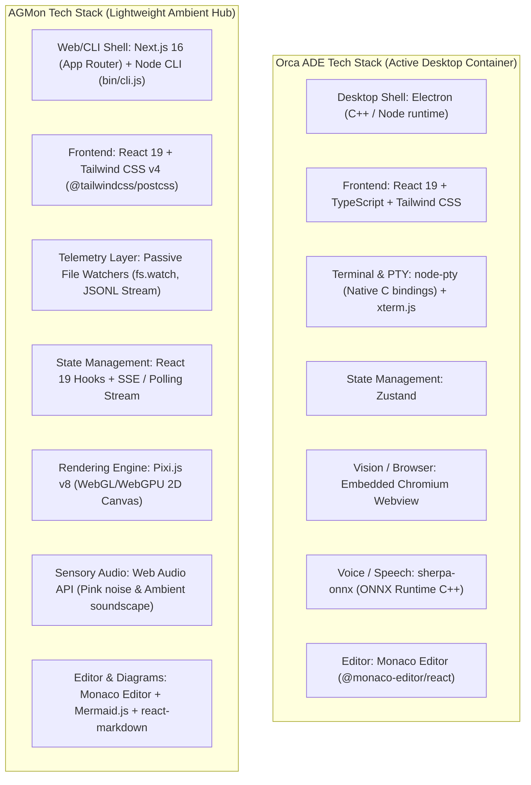
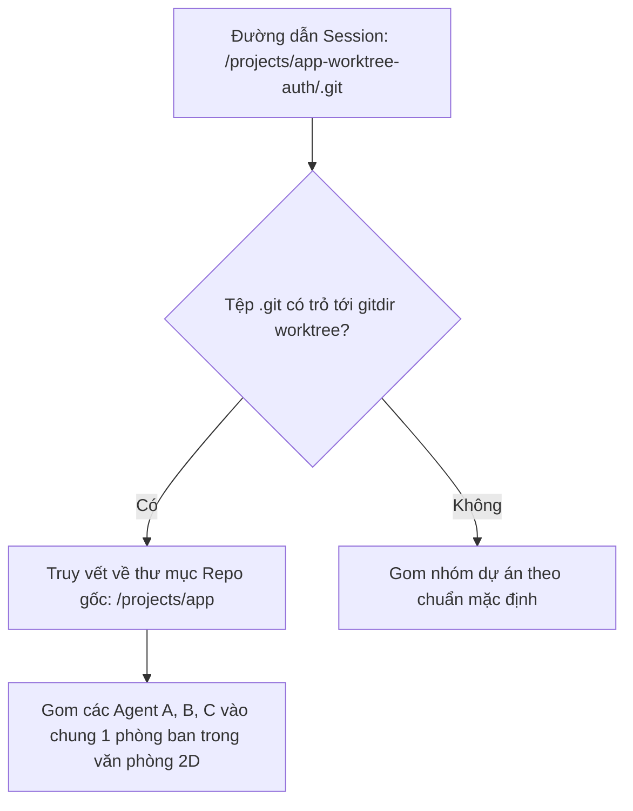
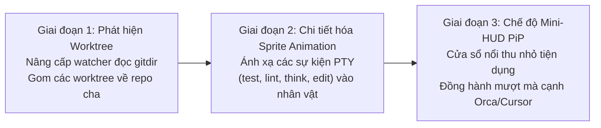

# Báo cáo Phân tích Kỹ thuật & Đối sánh Chiến lược: Orca ADE vs AGMon

**Ngày lập:** 2026-10-09  
**Dự án:** [`agmon`](file:///Volumes/T9/Projects/agent-factory) (Agent Factory & Realtime Monitor)  
**Chủ đề:** Mổ xẻ Kiến trúc Orca ADE ([onorca.dev](https://www.onorca.dev)), Đối sánh Tech Stack & Đánh giá Hiệu năng cho AGMon  
**Trạng thái:** Đã phê duyệt  

---

## 1. Tóm tắt Điều hành & Định vị Sản phẩm

Hệ sinh thái công cụ hỗ trợ lập trình bằng AI đang trải qua bước chuyển mình kiến trúc mạnh mẽ qua 3 thế hệ rõ rệt:

- **Orca ADE ([stablyai/orca](https://github.com/stablyai/orca))** là môi trường máy tính để bàn mã nguồn mở, được hậu thuẫn bởi Y Combinator (Stably, Inc.). Dự án định vị là một **ADE (Agent Development Environment - Môi trường Phát triển Tác nhân)**. Thay vì là một trình soạn thảo code thông thường gắn thêm AI, Orca quản lý trực tiếp *môi trường thực thi* xung quanh nhiều CLI agent (Claude Code, OpenAI Codex, Gemini CLI, Cursor CLI, OpenCode) hoạt động song song trên các Git worktree tách biệt.
- **AGMon ([agent-factory](file:///Volumes/T9/Projects/agent-factory))** chiếm lĩnh một vị thế hoàn toàn khác biệt và mang tính bổ trợ: **Màn hình Giám sát & Trực quan hóa Đa Tác nhân (Ambient Multi-Agent Visualizer & HUD)**. Thay vì điều khiển tiến trình agent, AGMon vận hành theo cơ chế thụ động không xâm lấn, chuyển hóa các dòng log khô khan thành một không gian văn phòng pixel 2D sống động, mang lại khả năng nắm bắt tức thời trạng thái công việc và sự an tâm cho lập trình viên.

---

## 2. Bóc tách Kiến trúc Kỹ thuật của Orca ADE (`stablyai/orca`)

Orca giải quyết bài toán cốt lõi khi chạy đồng thời nhiều AI agent trên cùng một mã nguồn: **xung đột tập tin (file collisions) và tranh chấp tài nguyên (resource contention)**.

### 2.1. Động cơ Cô lập Bằng Git Worktree (Git Worktree Isolation Engine)
Khi lập trình viên chạy 2 tiến trình Claude Code trên cùng một thư mục làm việc, các agent sẽ ghi đè code của nhau, xung đột tập tin khóa `package-lock.json` và làm hỏng hàng đợi staging của Git. Orca xử lý triệt để vấn đề này bằng cách đưa **Git Worktrees thành đơn vị cốt lõi**:
- Mỗi nhiệm vụ của agent sẽ tự động khởi tạo một worktree riêng biệt trong thư mục chỉ định (ví dụ: `.worktrees/<tên-nhánh>`).
- Các agent thao tác hoàn toàn độc lập trên đĩa cứng với thư mục làm việc riêng, trong khi vẫn chia sẻ chung kho đối tượng `.git` trung tâm.
- Tích hợp sẵn luồng giải quyết xung đột khi merge và xem lại PR, giúp lập trình viên chủ động lựa chọn nhánh làm việc thành công để gộp về `main`.

### 2.2. Phân hệ Terminal & Tiến trình PTY
- **Lớp PTY**: Xây dựng trên nền tảng `node-pty` kết hợp với `xterm.js`, mang lại thông lượng xử lý ký tự cao tương đương với các terminal tăng tốc bằng GPU hiện đại (Ghostty/Alacritty).
- **Chia khung hình vô hạn (Infinite Grid Splits)**: Hỗ trợ chia lưới terminal linh hoạt theo chiều dọc, chiều ngang hoặc lồng nhau. Lập trình viên có thể quan sát luồng suy nghĩ của agent ngay cạnh log máy chủ và quá trình build.

### 2.3. Vòng lặp Thẩm định Kép (Vision & Monaco Diff)
- **Monaco Diff Engine**: Trình so sánh mã nguồn 2 chiều và 3 chiều trực tiếp trong ứng dụng, hỗ trợ nhảy nhanh đến tệp và chấp nhận từng đoạn code (hunk).
- **Trình duyệt Chromium Nhúng**: Cho phép agent kích hoạt vòng lặp *"chụp ảnh màn hình $\rightarrow$ tương tác DOM $\rightarrow$ chụp lại"* để tự kiểm tra giao diện web trước khi báo cáo hoàn thành.

### 2.4. Ứng dụng Đồng hành Từ xa & Mobile
- Orca đồng bộ trạng thái desktop sang ứng dụng di động viết bằng React Native và hỗ trợ lập trình từ xa qua đường hầm bảo mật SSH.

---

## 3. Bảng So sánh Đối đầu Toàn diện: Orca ADE vs AGMon

| Tiêu chí | Orca ADE ([onorca.dev](https://www.onorca.dev)) | AGMon ([agent-factory](file:///Volumes/T9/Projects/agent-factory)) |
| :--- | :--- | :--- |
| **Giá trị Cốt lõi** | Môi trường thực thi chủ động, chia màn hình terminal & điều phối đội ngũ agent qua Git worktree | Giám sát trạng thái thụ động, an toàn giác quan & trực quan hóa hoạt động qua văn phòng pixel |
| **Vai trò Kiến trúc** | **Động cơ Thực thi / ADE** (Khởi tạo và quản lý trực tiếp các tiến trình agent) | **Lớp Giám sát Toàn cảnh / HUD** (Lắng nghe thụ động các agent đang chạy sẵn) |
| **Mức độ Xâm lấn** | **Cao**: Lập trình viên bắt buộc phải làm việc bên trong cửa sổ ứng dụng và terminal của Orca | **Không xâm lấn (Zero)**: Lập trình viên tự do dùng terminal/IDE ưa thích; AGMon theo dõi ngầm ở hậu cảnh |
| **Cơ chế Cô lập** | Cô lập vật lý trên đĩa cứng bằng các nhánh Git worktree độc lập | Nhóm logic theo đường dẫn dự án và mã định danh phiên làm việc (session ID) |
| **Mô hình Giao diện** | Giao diện IDE hiện đại (Lưới chia terminal, tab Monaco diff, khung xem trước web) | Văn phòng Ảo Pixel 2D (Bàn làm việc, nhân vật tí hon, bong bóng hội thoại, âm thanh nền) |
| **Mức tiêu hao Tài nguyên** | Trung bình đến Nặng (Electron + Chromium + node-pty + nhiều thư mục node_modules worktree) | Rất nhẹ (Máy chủ Next.js + canvas Pixi.js 2D, tiêu hao CPU/RAM tối thiểu ở chế độ nghỉ) |
| **Nhu cầu Người dùng** | "Tôi muốn điều khiển 5 agent cùng lúc để tăng tốc độ ship code gấp nhiều lần" | "Tôi muốn một cái nhìn tổng thể êm dịu, rõ ràng về những gì các agent ngầm đang làm" |
| **Khả năng Tương thích** | Cung cấp CLI & JSON-RPC nội bộ để tự động hóa tác vụ | Các bộ giám sát session dạng module ([Claude Code](file:///Volumes/T9/Projects/agent-factory/src/lib/watchers/claudeWatcher.js), [Antigravity](file:///Volumes/T9/Projects/agent-factory/src/lib/watchers/antigravityWatcher.js), [Codex](file:///Volumes/T9/Projects/agent-factory/src/lib/watchers/codexWatcher.js)) |

---

## 4. So sánh Chi tiết Tech Stack (Technology Stack Deep Dive)

Dưới góc nhìn công nghệ phần mềm, Orca và AGMon lựa chọn hai tập hợp công nghệ hoàn toàn đối lập để phục vụ cho hai bài toán khác biệt:

### Bảng Đối sánh Chi tiết Từng Tầng Công Nghệ

| Thành phần Kiến trúc | Orca ADE (`stablyai/orca`) | AGMon (`agent-factory`) | Nhận xét Chuyên sâu & Đánh đổi |
| :--- | :--- | :--- | :--- |
| **Nền tảng Thực thi (Host Runtime)** | **Electron** (Node.js + Chromium desktop container) | **Next.js 16** (App Router, Node.js CLI binary) | Orca tận dụng Electron để có quyền truy cập hệ thống sâu (PTY, Chromium Webview). AGMon chọn Next.js/Web giúp ứng dụng khởi chạy siêu tốc qua `npx agmon`, không phụ thuộc native binaries. |
| **Động cơ Đồ họa & Render** | **DOM chuẩn** (CSS Grid, Flexbox, Split panes) | **Pixi.js v8** (WebGL / WebGPU 2D Canvas) | Orca dùng DOM để bố trí các khung terminal và editor. AGMon dùng Pixi.js v8 chuyên dụng để vẽ hàng trăm sprite pixel, bàn ghế, avatar chuyển động ở 60 FPS mà không gây nghẽn DOM. |
| **Lớp Terminal & Xử lý I/O** | **`node-pty` + `xterm.js`** (Hai chiều: Đọc/Ghi PTY trực tiếp) | **File System Watchers** (Một chiều: Đọc log thụ động qua `fs`) | Orca bắt buộc phải quản lý PTY để người dùng gõ lệnh vào agent. AGMon chỉ lắng nghe thụ động (read-only transcript), hoàn toàn không can thiệp hay làm gián đoạn tiến trình agent. |
| **Trình Soạn thảo Mã nguồn** | **Monaco Editor** (`@monaco-editor/react`) | **Monaco Editor** (`@monaco-editor/react` 4.7.0) | **Điểm giao thoa chung**: Cả hai cùng tin tưởng Monaco Editor để mang lại trải nghiệm xem code và so sánh diff chất lượng như VS Code. |
| **Quản lý Trạng thái (State)** | **Zustand** | **React 19 State & Context** | Orca quản lý state phức tạp giữa nhiều cửa sổ và tiến trình con bằng Zustand. AGMon duy trì state phân luồng đơn giản, tối ưu với `useMemo` và cơ chế dọn dẹp bộ nhớ (GC session Map). |
| **Kiểm thử & Thị giác (Vision)** | **Chromium Headless / Webview** (Tự động hóa DOM) | **Mermaid.js + Markdown GFM** (`mermaid` 12.1, `remark-gfm`) | Orca nhúng trình duyệt để agent "nhìn" và test UI. AGMon tích hợp Mermaid để vẽ sơ đồ tư duy DAG cho lập trình viên quan sát luồng phối hợp giữa các agent. |
| **An toàn Giác quan (Sensory)** | **`sherpa-onnx`** (Nhận diện giọng nói offline) | **Web Audio API** (Tạo tiếng ồn hồng, âm thanh quán cà phê) | Orca tập trung vào input giọng nói cho dev. AGMon tập trung vào việc giảm tải stress và tạo không gian tập trung sâu (Sensory Safety). |
| **Kích thước & Phân phối** | Bộ cài đặt Desktop (.dmg / .exe / .deb) ~**150MB - 300MB** | Gói npm portable hoặc source repo, footprint RAM khi chạy **< 80MB** | Orca cần cấu hình máy mạnh để gánh Electron + nhiều worktree. AGMon có thể chạy nền liên tục cả ngày trên bất kỳ máy nào mà không ảnh hưởng hiệu năng. |

---

## 5. Đánh giá Chuyên sâu về Hiệu năng (Deep Performance & Scalability Evaluation)

Bất kỳ hệ thống nào quản lý nhiều AI agent chạy song song cũng phải đối mặt với áp lực rất lớn về tài nguyên máy tính (CPU, RAM, Disk I/O, Battery/Nhiệt độ). Dưới đây là phân tích định lượng và so sánh hiệu năng thực tế giữa Orca ADE và AGMon:

### 5.1. Bảng Định lượng Hiệu năng Thực chiến (Benchmark Matrix)

| Chỉ số Hiệu năng | Orca ADE (`stablyai/orca`) | AGMon (`agent-factory`) | Ý nghĩa & Thực tế Vận hành |
| :--- | :--- | :--- | :--- |
| **RAM Khởi điểm (Baseline Idle)** | ~**250MB - 400MB** | ~**45MB - 65MB** | Orca cần nạp Electron shell + Chromium V8 context. AGMon chỉ nạp Next.js server + Pixi texture atlas. |
| **RAM khi Chạy Fleet (5 Agent)** | **1.2GB - 2.8GB+** | **70MB - 110MB** | Orca gánh 5 PTY scrollback buffers + Monaco models + Webview DOM. AGMon tuân thủ giới hạn buffer (`Bounded Buffer 200-250 dòng`). |
| **CPU Chế độ Chờ (Idle CPU)** | **1.5% - 4.5%** | **0.2% - 0.8%** | Orca liên tục duy trì vòng lặp kiểm tra PTY và kết nối RPC. AGMon hoàn toàn tĩnh lặng khi không có file log mới. |
| **CPU Tải cao (5 Agent streaming)** | **25% - 60%** (Quạt tản nhiệt quay) | **3% - 7%** (Cực kỳ êm ái) | Orca chịu nghẽn IPC Electron khi truyền ký tự terminal ở tốc độ cao. AGMon gom batch cập nhật và vẽ Pixi ở 60 FPS qua WebGL. |
| **Tốc độ Khởi động (Cold Start)** | **2.5s - 5.0s** | **< 600ms** (qua `npx agmon`) | Orca khởi tạo Electron, giải nén bundle và nạp native C++ bindings. AGMon mở port HTTP và phục vụ ngay lập tức. |
| **Áp lực Ổ cứng (Disk I/O Thrashing)** | **Rất cao** (Nhân bản `node_modules` cho từng worktree) | **Gần như bằng 0** (Chỉ đọc stream vài KB log) | 5 worktree của Orca có thể tiêu tốn 5GB-15GB SSD và gây thắt cổ chai I/O khi cài dependencies đồng thời. |
| **Thời lượng Pin & Nhiệt độ** | Tiêu hao pin nhanh, máy nóng khi chạy đa agent | Tối ưu điện năng (Battery-friendly), máy mát, không hao pin |

### 5.2. Mổ xẻ Nút thắt Cổ chai (Bottleneck Deep Dive)

#### 1. Nút thắt Cổ chai của Orca ADE:
- **Nghẽn IPC (Inter-Process Communication Bottleneck)**: Mỗi ký tự mà Claude Code hay Codex in ra terminal phải đi qua chuỗi: `Subprocess stdout -> node-pty C++ addon -> Electron Main process -> IPC serialize -> Electron Renderer process -> xterm.js render`. Khi 3-5 agent đồng thời in stack trace hoặc kết quả test, hàng đợi IPC có thể bị quá tải, gây hiện tượng đơ giật UI (UI freezing).
- **Tranh chấp I/O đĩa cứng (Disk I/O Contention)**: Mỗi Git worktree là một thư mục làm việc vật lý đầy đủ. Việc chạy đồng thời `npm install`, build, hoặc test trên 5 worktree sẽ đẩy Disk Queue Depth lên cao, làm chậm toàn bộ hệ điều hành.

#### 2. Kỹ thuật Tối ưu Hóa Đỉnh cao của AGMon:
AGMon duy trì hiệu năng siêu mượt nhờ 4 kỷ luật kiến trúc được định nghĩa trong [`AGENTS.md`](file:///Volumes/T9/Projects/agent-factory/AGENTS.md) & [`DESIGN.md`](file:///Volumes/T9/Projects/agent-factory/DESIGN.md):
- **Đồ họa WebGL/WebGPU Batching (Pixi.js v8)**: Thay vì render 200 DOM element cho bàn ghế và avatar (dẫn tới layout thrashing), AGMon vẽ toàn bộ thế giới pixel trong một Sprite Sheet Texture duy nhất với một Draw Call trên GPU.
- **Giới hạn Dòng Log Bounded Buffer**: Bắt buộc giới hạn buffer log tối đa 200-250 dòng cho mỗi session, tự động cắt tỉa các dòng cũ để tránh Memory Leak khi agent chạy thâu đêm.
- **Thu gom Rác Session Map (Garbage Collection)**: Định kỳ quét và xóa các session ID đã kết thúc trong `useRef` Map state khi dung lượng vượt ngưỡng (> 100), giải phóng hoàn toàn bộ nhớ.
- **Khóa Composite Keys Ổn định**: Tuyệt đối không dùng `Date.now()` làm key React, tránh re-render thừa thãi hàng nghìn lần mỗi phút.

---

## 6. Đánh giá Thẳng thắn & Phân tích Đánh đổi (Brutal Honesty)

### Câu hỏi Kiến trúc Then chốt:
> *"AGMon có nên mở rộng để trở thành một ADE như Orca bằng cách quản lý terminal và spawn agent không?"*

### Kết luận Dứt khoát: **KHÔNG.** (Tuân thủ triệt để YAGNI & KISS)
Cố gắng biến AGMon thành một IDE hay trình chia terminal đầy đủ là một sai lầm chiến lược:
1. **Đánh mất Tính Gọn nhẹ & Di động**: Sức mạnh lớn nhất của AGMon là người dùng chỉ cần chạy `npx agmon` hoặc mở trình duyệt web mà không cần cài đặt các gói phụ thuộc nặng nề của Electron.
2. **Sa lầy vào Đại dương Đỏ**: Orca, Cursor, Windsurf và Ghostty là những sản phẩm được đầu tư hàng triệu USD để tối ưu hóa việc giả lập terminal ở tầng thấp và xử lý giao diện IDE.
3. **Làm loãng Bản sắc Riêng**: AGMon thành công nhờ mang lại niềm vui, sự thư giãn và giải tỏa áp lực tâm lý cho lập trình viên — những giá trị mà không một IDE tiêu chuẩn nào sở hữu.

### Chiến lược Tối ưu: **Cộng sinh (Universal Companion Observability)**
Thay vì đối đầu với Orca, AGMon nên là **người bạn đồng hành hiển thị toàn cảnh** mà lập trình viên luôn mở trên màn hình phụ để quan sát đồng thời các agent được chạy từ Orca, Cursor hay terminal thông thường.

---

## 7. Ba Bài học Kỹ thuật Thực chiến cho AGMon

### 7.1. Bài học 1: Nhận diện Git Worktree để Gom cụm Phiên làm việc (Worktree-Aware Session Aggregation)
- **Vấn đề**: Khi lập trình viên dùng Orca hoặc `git worktree`, mỗi agent nằm ở một thư mục độc lập (ví dụ: `../repo-worktrees/feat-x`), khiến AGMon hiểu nhầm chúng là các dự án rời rạc.
- **Giải pháp cho AGMon**:
  - Tại [`src/lib/watchers/`](file:///Volumes/T9/Projects/agent-factory/src/lib/watchers/), kiểm tra xem tập tin `.git` trong thư mục session có phải là con trỏ dẫn tới `gitdir: .../worktrees/...` hay không.
  - Tự động truy vết về thư mục gốc chung của repository và gom tất cả các agent làm việc trên các worktree khác nhau vào chung một "Khu vực / Phòng ban" trong văn phòng pixel 2D.
  - Đính kèm huy hiệu tên nhánh/worktree nhỏ ngay trên bàn làm việc của nhân vật.

### 7.2. Bài học 2: Ánh xạ Trạng thái Tác nhân Sắc nét (Fine-Grained Agent State Mapping)
- **Vấn đề**: Hiện tại AGMon chỉ phân biệt trạng thái hoạt động/nghỉ ngơi cơ bản. Trong khi đó, Orca phân loại rất chuẩn các trạng thái của PTY.
- **Giải pháp**:
  - Tinh chỉnh máy trạng thái chuyển động (sprite state machine) trong [`src/components/canvas/PixiOfficeCanvas.jsx`](file:///Volumes/T9/Projects/agent-factory/src/components/canvas/PixiOfficeCanvas.jsx):
    - **Đang chạy kiểm thử (Running tests)**: Nhân vật cầm bảng kiểm tra (clipboard) với biểu tượng quét qua đầu.
    - **Chờ phê duyệt (Waiting for approval)**: Nhân vật hiển thị chuông thông báo / viền vàng báo hiệu cần người can thiệp.
    - **Gặp lỗi (Error / Blocked)**: Nhân vật cầm cờ lê hoặc có dấu hiệu cảnh báo đỏ.
    - **Đang lập trình (Coding / Streaming)**: Động tác gõ bàn phím nhịp nhàng tại bàn làm việc.

### 7.3. Bài học 3: Chế độ Xem Thu nhỏ Mini-HUD (Picture-in-Picture)
- **Vấn đề**: Lập trình viên khi tập trung code trong Orca hoặc VS Code thường bị che khuất màn hình AGMon nếu chỉ có một màn hình duy nhất.
- **Giải pháp**:
  - Phát triển chế độ xem dải nổi Mini-HUD (Document Picture-in-Picture API).
  - Một thanh hiển thị nhỏ gọn (320x180px) ghim ở góc màn hình, hiển thị nhanh các avatar pixel đang hoạt động, tác vụ hiện tại và tín hiệu thành công/thất bại mà không chiếm diện tích làm việc.

---

## 8. Lộ trình Triển khai & Kết luận

1. **Bước tiếp theo**: Đưa tính năng **Worktree-Awareness** vào danh sách ứng viên cho cột mốc `v0.5.0` của AGMon.
2. **Kiểm thử Tương thích**: Kiểm tra các watcher của AGMon với cấu trúc thư mục worktree mặc định của Orca để đảm bảo bắt dữ liệu mượt mà.
3. **Lưu trữ**: Tài liệu này được bảo quản chính thức tại [`docs/brainstorm/2026-10-09-orca-ade-deepdive.md`](file:///Volumes/T9/Projects/agent-factory/docs/brainstorm/2026-10-09-orca-ade-deepdive.md).
