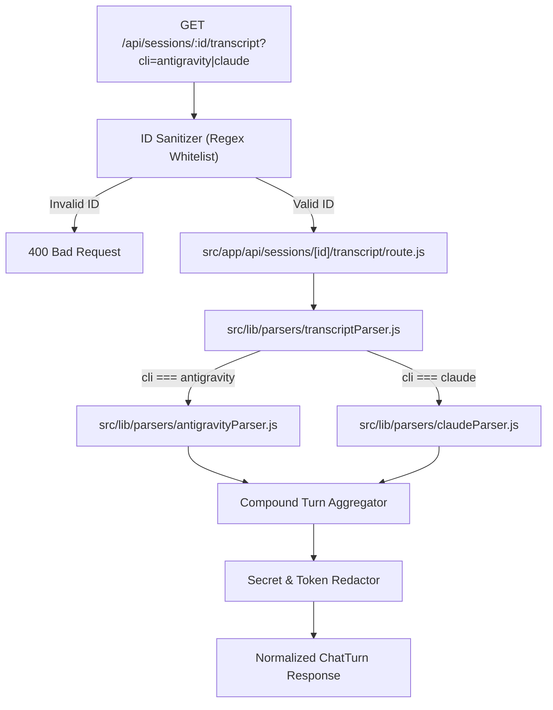

# Phase 1: Transcript Parser & API

## Overview
Develop high-performance, security-hardened parsing utilities for local session logs (Antigravity CLI and Claude Code CLI) and expose a unified Next.js API route `/api/sessions/[id]/transcript` that aggregates complex multi-step agent actions into clean, normalized conversation turns.

## Requirements
- **Functional:**
  - **Security & Path Validation:** Strictly sanitize session IDs with regex `/^[a-zA-Z0-9_-]{4,64}$/`. Prevent directory traversal (`..`) and verify resolved file path resides inside expected base paths (`~/.gemini/antigravity-cli/brain/` or `~/.claude/projects/`). Return 400 Bad Request on invalid IDs.
  - **Credential & Secret Redaction:** Apply regex redaction masking on all prompts, tool inputs, and tool outputs for sensitive patterns:
    - Bearer tokens, JWTs, OAuth headers.
    - GitHub personal access tokens (`ghp_[a-zA-Z0-9]+`), AWS keys, OpenAI keys (`sk-[a-zA-Z0-9]+`).
    - Sensitive env vars (`*_KEY`, `*_SECRET`, `*_TOKEN`).
  - **Compound Turn Aggregator (State Machine):**
    - A single interaction begins with `USER_INPUT` (cleanse `<USER_REQUEST>` wrapper, extract media & timestamp).
    - Aggregate all intermediate `PLANNER_RESPONSE` (reasoning, tool calls) and `GENERIC` (tool stdout/stderr) events occurring before the next `USER_INPUT` into a single compound Assistant Turn.
    - Maintain tool call linking: map each `tool_call` ID to its subsequent `GENERIC` execution output.
    - Capture the final text output of the turn as the main `content`.
    - Sum cumulative tokens (`input_tokens`, `output_tokens`, `cache_read_tokens`) across all intermediate steps for that turn.
  - **Partial Write Fault-Tolerance:** When an agent is currently executing, the trailing line of `transcript.jsonl` may be partially flushed. If `JSON.parse` fails on the final line of an active session, skip it gracefully without throwing 500.
  - **Claude Code Path Discovery:** Reuse robust project search logic from `src/lib/watchers/claudeWatcher.js` scanning both `~/.claude/projects/*/[id].jsonl` and reading session metadata from `~/.claude/sessions/[id].json`.
- **Non-functional:**
  - Response time < 50ms for typical transcripts (< 100 turns).
  - Stream/chunk large session files (> 10MB) without memory spikes.

## Architecture

## Related Code Files
- Create: `src/lib/parsers/transcriptParser.js`
- Create: `src/lib/parsers/antigravityParser.js`
- Create: `src/lib/parsers/claudeParser.js`
- Create: `src/lib/parsers/secretRedactor.js`
- Create: `src/app/api/sessions/[id]/transcript/route.js`
- Modify: `src/lib/traceContract.js`

## Implementation Steps
1. Create `src/lib/parsers/secretRedactor.js`:
   - Implement `redactSecrets(text)` replacing sensitive patterns (API keys, auth headers, private keys) with `[REDACTED_SECRET]`.
2. Create `src/lib/parsers/antigravityParser.js`:
   - Validate and resolve path: ensure target file exists strictly within `~/.gemini/antigravity-cli/brain/<id>`.
   - Read lines line-by-line; safely ignore invalid trailing line if active.
   - Build Turn State Machine:
     - On `USER_INPUT`: push previous assistant turn (if any) and push new `user` turn.
     - On `PLANNER_RESPONSE`: accumulate `thinking`, collect `tool_calls`, record token deltas, capture interim text.
     - On `GENERIC`: associate content as output to the most recent running tool call.
     - On final response: set assistant turn final content.
3. Create `src/lib/parsers/claudeParser.js`:
   - Implement project discovery fallback logic matching `src/lib/watchers/claudeWatcher.js:84-97`.
   - Map Claude events (`human` -> user turn, `assistant` -> assistant turn, `tool_use` + `tool_result`).
4. Create `src/lib/parsers/transcriptParser.js`:
   - Facade router dispatching to `antigravityParser` or `claudeParser`.
   - Run `secretRedactor` across turn texts and tool arguments before returning.
5. Implement API Route `src/app/api/sessions/[id]/transcript/route.js`:
   - Enforce regex `/^[a-zA-Z0-9_-]{4,64}$/`.
   - Return `{ ok: true, session: { id, model, cli, startedAt, tokens }, turns: [...] }`.

## Success Criteria
- [ ] Direct curl to `/api/sessions/[active-conv-id]/transcript` returns valid JSON with `turns` array.
- [ ] Attempting directory traversal (e.g. `../../etc`) returns 400 Bad Request immediately.
- [ ] Multi-step agent actions collapse into a single coherent assistant turn containing all executed tools.
- [ ] Any API key or Bearer token is replaced by `[REDACTED_SECRET]`.
- [ ] Reading active session during execution does not throw `JSON.parse` crash.

## Risk Assessment
- **Risk:** Malicious path traversal targeting filesystem.
  - *Mitigation:* Strict regex whitelist + `path.resolve` check ensuring target starts with allowed root directory.
- **Risk:** Sensitive keys exposed in shared screens.
  - *Mitigation:* Server-side regex secret redactor applied before sending response.
