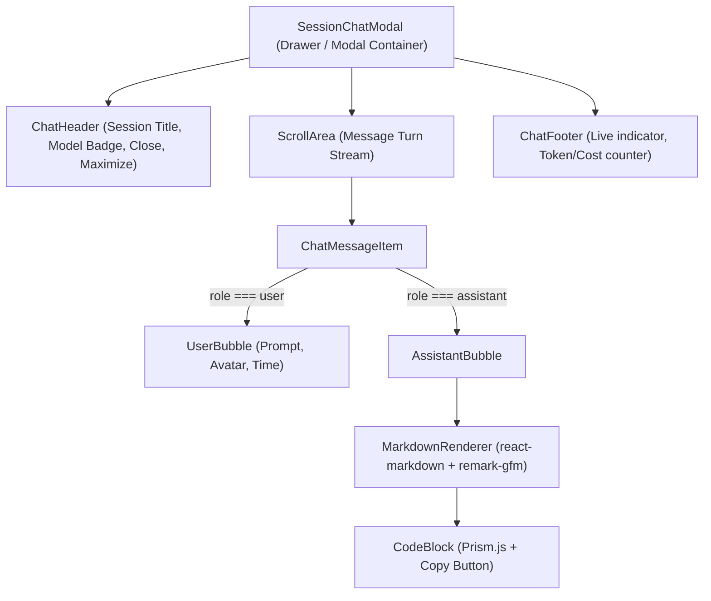

# Phase 2: Core Chat UI & Markdown

## Overview
Build the visual foundation of the AI Chat Window: the container modal/drawer, user & assistant message bubbles, responsive layout, and rich Markdown rendering with code syntax highlighting and one-click copy.

## Requirements
- **Functional:**
  - Responsive chat container supporting:
    - Centered large modal overlay with backdrop blur.
    - Side-docked full-height drawer mode (allowing viewing the 2.5D factory and chat side-by-side).
    - Full-screen maximize toggle.
  - User message bubble: distinct background, user avatar, cleaned prompt text, timestamp.
  - Assistant message bubble: robot avatar styled after the agent's desk color, model badge, response content rendered via Markdown.
  - Markdown engine capabilities:
    - GitHub Flavored Markdown (tables, checklists, blockquotes, links, bold/italic).
    - Code blocks with language detection, syntax highlighting, line numbers, and a "Copy Code" button.
  - Controls: Search within turns, Auto-scroll to bottom toggle, Jump to bottom button when scrolled up.
- **Non-functional:**
  - Zero hydration mismatch in Next.js 16 App Router (`"use client"`).
  - Fast rendering without lag during rapid message append.

## Architecture


## Related Code Files
- Create: `src/components/chat/SessionChatModal.js`
- Create: `src/components/chat/ChatMessageItem.js`
- Create: `src/components/chat/MarkdownRenderer.js`
- Create: `src/components/chat/CodeBlock.js`
- Modify: `package.json` (add `react-markdown`, `remark-gfm`, `prismjs`, `lucide-react`)
- Modify: `src/app/globals.css` (custom markdown styling classes)

## Implementation Steps
1. Install dependencies:
   ```bash
   npm install react-markdown remark-gfm prismjs lucide-react
   ```
2. Create `src/components/chat/CodeBlock.js`:
   - Syntax highlight code with `prismjs`.
   - Add language header bar (e.g. `javascript`, `python`, `bash`) with status and "Copy" icon button with feedback animation.
3. Create `src/components/chat/MarkdownRenderer.js`:
   - Wrap `react-markdown` with `remark-gfm`.
   - Custom component overrides for `code`, `a` (external target), `table`, `blockquote`.
4. Create `src/components/chat/ChatMessageItem.js`:
   - Differentiate layout for `role === "user"` vs `role === "assistant"`.
   - Add timestamp formatting, role pill badge, avatar.
5. Create `src/components/chat/SessionChatModal.js`:
   - Modal/Drawer layout with header controls (Close, Dock to Right, Fullscreen).
   - Scrollable message viewport with auto-scroll management (`useRef`).

## Success Criteria
- [ ] Chat window opens cleanly with smooth entrance transition.
- [ ] User and Assistant messages render clearly with dark-theme contrast.
- [ ] Markdown text formats correctly (headings, bullets, tables).
- [ ] Code blocks show syntax highlights and copy button successfully copies code to clipboard.

## Risk Assessment
- **Risk:** Markdown CSS interfering with global Tailwind styles.
  - *Mitigation:* Scope all markdown styles under `.chat-markdown` class container.
- **Risk:** SSR hydration errors with `prismjs` or `window`.
  - *Mitigation:* Ensure `prismjs` highlighting runs client-side or use pure CSS token rendering.
