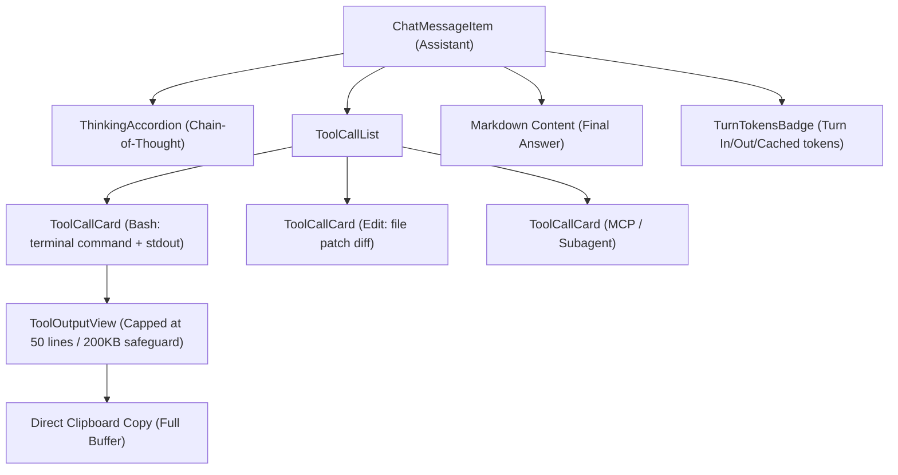

# Phase 3: Agent Tool & Thinking Visualizers

## Overview
Implement specialized UI widgets for coding agent actions: collapsible Chain-of-Thought (Thinking) accordions, terminal command execution logs with stdout/stderr toggles, memory-safe output virtualizers, and subagent delegation cards.

## Requirements
- **Functional:**
  - **ThinkingAccordion:**
    - Collapsed by default showing duration or word summary (e.g. *"Thought for 8s (342 words)"*).
    - Expandable with purple/slate glowing border, monospace or styled serif reasoning text.
    - Preserves formatting of internal agent deliberation.
  - **ToolCallCard:**
    - Renders tool invocations inside the assistant turn before the final response.
    - Specific styling by category:
      - `bash` / `run_command`: Monospace terminal strip with command line, working directory badge (`cwd`), status badge (running/exit 0/exit 1), and collapsible stdout/stderr box.
      - `edit` / `write_to_file`: File modification card showing file path, action description, and patch diff view (red/green lines).
      - `read` / `view_file`: Path badge with target line numbers (`L10-L45`).
      - `search` / `grep`: Search pattern badge with result count.
      - `browser` / `playwright`: Action badge (navigate, click, snapshot).
      - `agent` / `invoke_subagent`: Subagent delegation card with subagent role, prompt preview, and recipient conversation link.
      - `gitnexus` / `mcp`: MCP tool and server name tag.
  - **Megabyte-Scale Output Safeguard (ToolOutputView):**
    - Truncate any single tool output exceeding 200KB to protect the React DOM from freezing.
    - Initial view shows only the first 50 lines (with total line count badge e.g. *"Showing 50 of 1,420 lines"*).
    - "Show Full Output" toggle reveals remaining lines with lazy rendering or virtualized scrolling.
    - "Copy Output" button copies the complete un-truncated text to clipboard directly without rendering it all into DOM.
  - Status Indicators:
    - Running: Animated spinning cog or pulsating cyan dot.
    - Done: Green checkmark badge.
    - Error: Rose hazard icon with error trace summary.
- **Non-functional:**
  - Compact vertical footprint when collapsed so multi-tool turns do not overwhelm the view.
  - Zero browser tab freeze even when viewing massive build logs or dependency trees.

## Architecture

## Related Code Files
- Create: `src/components/chat/ThinkingAccordion.js`
- Create: `src/components/chat/ToolCallCard.js`
- Create: `src/components/chat/ToolOutputView.js`
- Create: `src/components/chat/TurnTokensBadge.js`
- Modify: `src/components/chat/ChatMessageItem.js`

## Implementation Steps
1. Create `src/components/chat/ThinkingAccordion.js`:
   - Collapsible panel with chevron toggle.
   - Calculate reading time / duration if timestamps are present.
   - Smooth slide-down animation via Tailwind classes.
2. Create `src/components/chat/ToolOutputView.js`:
   - Monospace terminal viewer with dark background (`bg-black/90`).
   - Line-slice guard: if `lines.length > 50`, render only lines 0..50 and display button `Show all ${total} lines`.
   - String truncation guard: if `output.length > 200_000`, truncate preview with warning banner.
   - Provide "Copy Log" button using native navigator.clipboard.
3. Create `src/components/chat/ToolCallCard.js`:
   - Header with tool icon (matching AGMon `tool-icons.js` mapping), tool name, and brief summary.
   - Body showing input parameters (command line, target file, query).
   - Embedded `ToolOutputView` for result.
4. Create `src/components/chat/TurnTokensBadge.js`:
   - Subtle badge at the bottom of the turn showing turn latency and tokens (`In: 1.2k | Out: 430 | Cached: 8.5k`).
5. Integrate all visualizers into `src/components/chat/ChatMessageItem.js`.

## Success Criteria
- [ ] Model thinking blocks are neatly collapsed by default and expand on click.
- [ ] Large command outputs (e.g. 5,000 lines) render instantly without lag, capped at 50 lines initially.
- [ ] Full log can be copied to clipboard with one click.
- [ ] Tool cards clearly display success (green) vs error (red) states.

## Risk Assessment
- **Risk:** Command output containing huge logs freezing the browser.
  - *Mitigation:* Hard line cap (50 lines) + length cap (200KB) + headless clipboard copy.
