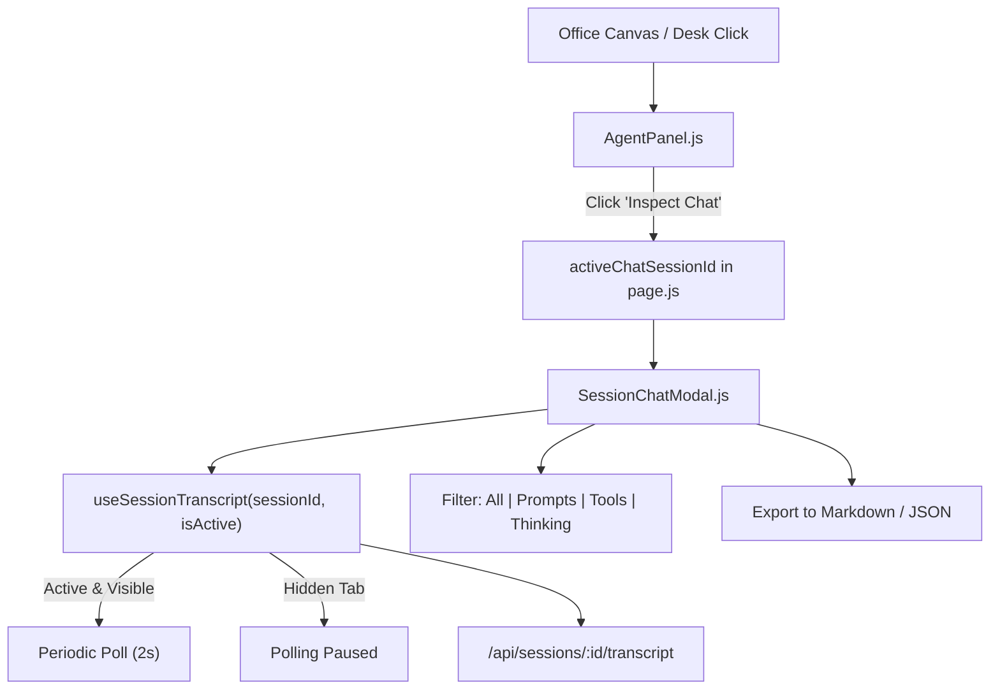

# Phase 4: Panel Integration & Live Stream

## Overview
Connect the AI Chat Window to the AGMon main dashboard: add trigger buttons to `AgentPanel` and office desks, support live polling/SSE turn append when an agent is active with backoff safeguards, and add quick filter and export features.

## Requirements
- **Functional:**
  - **Triggers:**
    - Button *"Inspect Chat"* on [`AgentPanel.js`](file:///Volumes/T9/Projects/agent-factory/src/components/factory/AgentPanel.js) next to Terminal tab.
    - Double-click on an agent desk in [`office-canvas.js`](file:///Volumes/T9/Projects/agent-factory/src/components/factory/office-canvas.js) opens its session chat directly.
    - Keyboard shortcut (`C` or `Space` when a desk is selected) opens the conversation.
  - **Live Streaming & Polling Safeguards:**
    - When viewing an active agent (`state === "streaming"` or `"pending"`), poll `/api/sessions/[id]/transcript` every 2s to append new turns in real-time.
    - **Tab Inactivity Backoff:** Pause polling when document is hidden (`document.visibilityState === "hidden"`).
    - **Modal Scope Only:** Polling activates ONLY while the chat modal is currently open; terminates immediately when closed.
    - Auto-scroll keeps up with new messages if the user is already at the bottom; pauses auto-scroll if the user scrolls up to review history.
  - **Filtering & Tools:**
    - Filter tabs: `[All]`, `[Prompts Only]`, `[Tools & Diffs]`, `[Thinking]`.
    - Export button: Export full dialogue to Markdown file (`.md`) or raw JSON.
  - **Offline & Demo Mode:**
    - Provide rich sample turns in [`mockTraces.js`](file:///Volumes/T9/Projects/agent-factory/src/lib/mockTraces.js) so users evaluating demo presets can experience the chat window with zero local agent logs.
- **Non-functional:**
  - Zero memory leaks when polling is active.
  - Smooth integration without degrading Pixi.js 60 FPS canvas loop.

## Architecture

## Related Code Files
- Modify: `src/components/factory/AgentPanel.js`
- Modify: `src/app/page.js`
- Modify: `src/lib/mockTraces.js`
- Create: `src/lib/useSessionTranscript.js`
- Modify: `src/components/factory/office-canvas.js`

## Implementation Steps
1. Create `src/lib/useSessionTranscript.js`:
   - React hook to fetch and cache transcript data for a session ID.
   - Handles auto-polling when `isActive` is true, with `document.visibilityState` listener.
   - Exposes `turns`, `loading`, `error`, `refresh`, and `exportMarkdown`.
2. Update `src/app/page.js`:
   - Add `chatSessionId` state.
   - Render `<SessionChatModal session={activeChatSession} onClose={() => setChatSessionId(null)} />`.
3. Update `src/components/factory/AgentPanel.js`:
   - Add tab button `[Chat]` or prominent button `[Open AI Chat View]`.
   - Wire onClick to open the chat window for `ws.traceId`.
4. Update `src/lib/mockTraces.js`:
   - Add mock turns (user prompts, thinking steps, bash commands, markdown code answers) for presets (`cases`, `busy`, `looping`).
5. Add Export Feature:
   - Client-side generation of `.md` blob and trigger browser file download.

## Success Criteria
- [ ] Clicking "Inspect Chat" in `AgentPanel` opens the conversation for that specific agent.
- [ ] Active sessions update with new turns as commands run in the terminal.
- [ ] Switching browser tabs pauses background transcript network requests.
- [ ] Filter buttons instantly toggle visibility of tools vs text messages.
- [ ] "Export Markdown" downloads a clean, readable transcript file.
- [ ] Demo presets render complete conversation examples when offline.

## Risk Assessment
- **Risk:** High network request frequency if multiple tabs are polling.
  - *Mitigation:* Only poll the currently open chat modal, stop polling immediately when modal closes or session completes.
