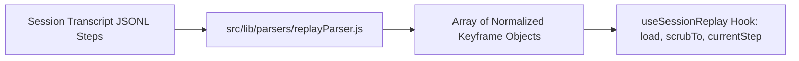

# Phase 1: Event Normalizer & Keyframe Parser

## Overview
Xây dựng engine chuẩn hóa dữ liệu từ transcript JSONL của Antigravity CLI và Claude Code thành mảng các mốc sự kiện (Timeline Keyframes) có thứ tự thời gian, tính toán giây trôi qua, trạng thái Agent tương ứng, và token lũy kế.

## Requirements
- **Functional**:
  - Trích xuất toàn bộ các bước sự kiện từ `transcript.jsonl` hoặc payload `/api/sessions/[id]/transcript`.
  - Phân loại bước thành các type: `user_input`, `thought`, `tool_call`, `tool_result`, `file_write`, `subagent_invoke`, `error`, `finish`.
  - Tính toán `elapsedSeconds` (tính từ thời điểm bắt đầu session) và `cumulativeTokens`, `cumulativeCost`.
  - Gán trạng thái thị giác cho Agent (`agentState`: `idle`, `thinking`, `typing`, `running_tool`, `error`, `done`).
- **Non-functional**:
  - Thời gian parse một session 200 steps < 25ms.
  - Xử lý mượt mà cả khi transcript đang ghi dở (active session) hoặc đã hoàn tất.

## Architecture & Data Flow

## Related Code Files
- **Create**: `src/lib/parsers/replayParser.js`
- **Create**: `src/lib/useSessionReplay.js`
- **Inspect**: `src/lib/parsers/transcriptParser.js`
- **Inspect**: `src/app/api/sessions/[id]/transcript/route.js`

## Implementation Steps
1. Khởi tạo `src/lib/parsers/replayParser.js` với hàm `normalizeTranscriptToKeyframes(transcriptData)`.
2. Bổ sung trích xuất thông tin tool parameters, output summary và đường dẫn file bị sửa (nếu có `write_to_file` hoặc `replace_file_content`).
3. Tạo hook `src/lib/useSessionReplay.js` quản lý state: `keyframes`, `currentStepIndex`, `isPlaying`, `playbackSpeed`, `currentTime`.
4. Viết unit test / test script chạy thử với transcript mẫu từ `~/.gemini/antigravity-cli/brain/`.

## Success Criteria
- [ ] Chuyển đổi thành công 1 transcript thực tế thành danh sách keyframe chuẩn xác.
- [ ] Các bước `tool_call` nhận diện đúng tên tool và trạng thái agent.
- [ ] Token và chi phí lũy kế tăng dần đều qua từng bước.
