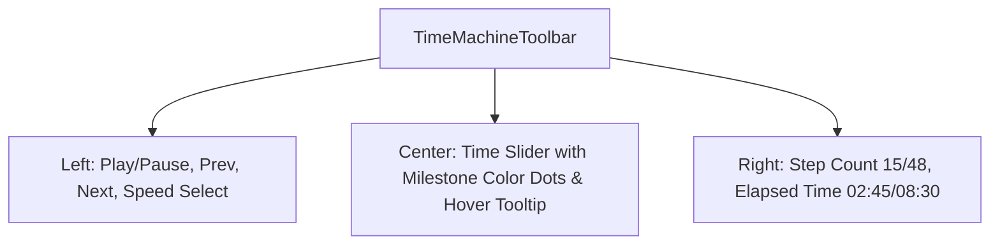

# Phase 2: TimeMachine Scrubber & Player Controls

## Overview
Xây dựng thanh công cụ điều khiển Time-Machine Toolbar (`TimeMachineToolbar.jsx`) với thanh trượt dải thời gian (Scrubber), các mốc Milestone trực quan bằng màu sắc, các nút Play/Pause, chọn tốc độ (1x, 2x, 5x, 10x) và tua tiến/lùi từng bước.

## Requirements
- **Functional**:
  - Nút Play / Pause điều khiển vòng lặp phát lại tự động theo tốc độ cấu hình.
  - Bộ chọn tốc độ: `1x`, `2x`, `5x`, `10x`.
  - Nút Next Step / Previous Step để di chuyển từng bước một.
  - Thanh trượt Scrubber: kéo thả chuột trực tiếp để nhảy tới bất kỳ thời điểm nào trong phiên.
  - Hiển thị các chấm mốc sự kiện (Milestones) trên thanh trượt theo màu:
    - Xanh ngọc (`cyan`): Tool calls
    - Xanh lá (`emerald`): Finish / Done
    - Vàng hổ phách (`amber`): User input
    - Đỏ (`rose`): Error
  - Hiển thị số bước hiện tại và tổng thời gian: `Bước 15/48 • 02:45 / 08:30`.
- **Non-functional**:
  - Không gây giật lag khi kéo chuột nhanh trên thanh trượt (< 16ms phản hồi).
  - Tuân thủ 100% icon `lucide-react` và shared UI từ `@/components/ui`.

## Architecture & UI Layout

## Related Code Files
- **Create**: `src/components/replay/TimeMachineToolbar.jsx`
- **Use**: `src/components/ui/Button.jsx`
- **Use**: `src/components/ui/Select.jsx`
- **Use**: `src/components/ui/Badge.jsx`
- **Use**: `src/components/ui/Tooltip.jsx`

## Implementation Steps
1. Xây dựng component `TimeMachineToolbar.jsx` sử dụng `@/components/ui` (`Button`, `Select`, `Tooltip`).
2. Tích hợp thanh input dải thời gian với custom CSS track hiển thị các vạch mốc sự kiện.
3. Tạo vòng lặp playback mượt mà bằng `requestAnimationFrame` kết hợp delta-time theo tốc độ đã chọn (`1x` = thời gian thực, `5x` = nhanh gấp 5 lần).
4. Hiển thị tooltip xem trước khi rê chuột (hover) trên thanh trượt: hiển thị tên sự kiện tại điểm trỏ chuột.

## Success Criteria
- [ ] Bấm Play -> thời gian và bước nhảy tăng dần đều theo đúng tốc độ đã chọn.
- [ ] Kéo thanh trượt Scrubber -> bước hiện tại nhảy ngay lập tức không bị khựng.
- [ ] Các chấm mốc sự kiện hiển thị đúng vị trí theo tỷ lệ phần trăm thời gian.
