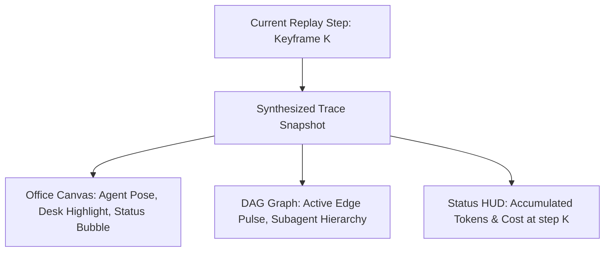

# Phase 3: Canvas & Graph Retrospective State Sync

## Overview
Kết nối trạng thái của đầu đọc Time-Machine (Playhead) với động cơ Canvas 2D Văn Phòng (PixiJS) và Multi-Agent DAG Graph để nhân vật Agent và sơ đồ mạng lưới thực sự phản chiếu lại hành động trong quá khứ tương ứng với thời điểm được tua tới.

## Requirements
- **Functional**:
  - Khi tua đến bước K:
    - Bàn làm việc của Agent tương ứng được highlight.
    - Nhân vật Agent đổi tư thế (gõ máy tính khi `tool_call`, suy nghĩ khi `thought`, đứng dậy khi `done`, giật mình khi `error`).
    - Bóng thoại trạng thái (Status bubble) trên đầu Agent hiển thị đúng nội dung hành động ở bước đó.
    - Cập nhật số token tích lũy và chi phí hiển thị trên HUD tại thời điểm K.
  - Hỗ trợ chế độ xem song song: Vừa hiển thị Canvas / Graph, vừa có thanh TimeMachine Toolbar ghim ở chân màn hình.
- **Non-functional**:
  - Không phá vỡ luồng live stream thông thường khi người dùng tắt chế độ Replay.
  - Tự động chuyển đổi giữa "Live Mode" và "Replay Mode" rõ ràng.

## Architecture

## Related Code Files
- **Modify**: `src/components/factory/office-canvas.js` (nhận tham số replay snapshot)
- **Modify**: `src/components/factory/AgentGraphView.jsx` (hỗ trợ hiển thị trạng thái hồi tố)
- **Create**: `src/components/replay/ReplayModeOverlay.jsx` (wrapper ghim Toolbar lên Canvas/Graph)
- **Modify**: `src/components/layout/VSCodeWorkbench.jsx`

## Implementation Steps
1. Xây dựng hàm tạo `synthesizeTraceFromKeyframe(keyframe)` biến một keyframe lịch sử thành trace object tương thích với OfficeCanvas.
2. Thêm chế độ `isReplaying` vào Canvas và Graph view: khi bật, Canvas nhận trace giả lập từ TimeMachine thay vì trace live từ SSE.
3. Tạo banner thông báo rõ ràng trên màn hình: `[Replay Mode: Phiên <ID>] - Bấm "Thoát Replay" để quay lại thời gian thực`.
4. Đồng bộ số token và chi phí thời gian thực tế hiển thị trên StatusBar / TopBar.

## Success Criteria
- [ ] Nhân vật Agent trên Canvas cử động và đổi bóng thoại nhịp nhàng khi thanh timeline chạy.
- [ ] Bấm "Thoát Replay" lập tức đưa giao diện về trạng thái Live bình thường mà không cần F5 tải lại trang.
