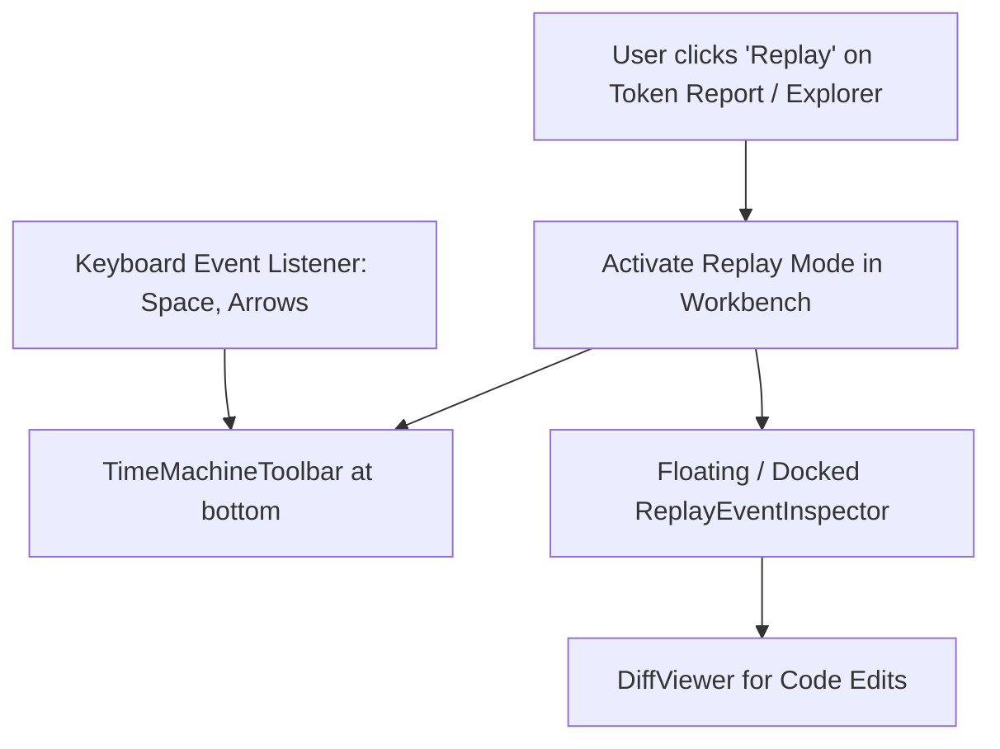

# Phase 4: Inspector & Keyboard Shortcuts Integration

## Overview
Xây dựng cửa sổ chi tiết sự kiện (`ReplayEventInspector`), tích hợp hệ thống phím tắt bàn phím chuẩn (`Space`, `Arrows`, `Home`, `End`), nút kích hoạt Replay từ Token Report và Session Explorer, kiểm thử toàn diện và đóng gói hoàn thiện.

## Requirements
- **Functional**:
  - **ReplayEventInspector Card**: Hiển thị chi tiết bước hiện tại:
    - Loại bước (`Badge`: User Input, Thought, Tool Call, File Edit, Error...).
    - Tên tool call và danh sách parameters đã truyền.
    - Kết quả trả về (Command stdout / file content preview).
    - Code diff highlight nếu là bước chỉnh sửa file.
  - **Phím tắt bàn phím (Keyboard Shortcuts)**:
    - `Space`: Tạm dừng / Tiếp tục (Play / Pause).
    - `ArrowLeft` / `ArrowRight`: Lùi 1 bước / Tiến 1 bước.
    - `Shift + ArrowLeft` / `Shift + ArrowRight`: Nhảy đến mốc Tool Call trước / sau.
    - `Home` / `End`: Tua về đầu (Bước 0) / Tua đến cuối (Bước kết thúc).
  - **Điểm kích hoạt (Entry points)**:
    - Nút "Tua lại phiên (Replay)" trong bảng lịch sử của `TokenReportView.jsx`.
    - Nút "Replay" trên SessionChatModal và LeftSidebar Explorer.
- **Non-functional**:
  - Phím tắt không kích hoạt nhầm khi người dùng đang gõ trong ô Input.
  - Build Next.js không có cảnh báo hay lỗi Hydration.

## Architecture

## Related Code Files
- **Create**: `src/components/replay/ReplayEventInspector.jsx`
- **Modify**: `src/components/reports/TokenReportView.jsx` (thêm nút Replay vào từng dòng bảng phiên)
- **Modify**: `src/components/layout/LeftSidebar.jsx` (thêm action Replay cạnh session)
- **Modify**: `src/components/layout/CommandPalette.jsx` (thêm lệnh Replay Session)

## Implementation Steps
1. Xây dựng `ReplayEventInspector.jsx` sử dụng `Modal` hoặc collapsible side card với code diff highlight.
2. Thiết lập hook lắng nghe phím tắt toàn cục có kiểm tra `e.target.tagName !== 'INPUT'`.
3. Gắn nút "Replay" (icon `History` hoặc `RotateCcw`) vào từng phiên trong `TokenReportView.jsx`.
4. Kiểm thử tổng thể (Integration Testing): tua lại các phiên Antigravity và Claude Code thực tế.
5. Chạy `npm run build` xác nhận không có lỗi compile.

## Success Criteria
- [ ] Bấm nút Replay từ bất kỳ phiên nào trong Báo Cáo Token mở ngay thanh TimeMachine.
- [ ] Bấm phím Space để Play/Pause và phím mũi tên để tua từng bước hoạt động mượt mà.
- [ ] Code diff hiển thị chính xác các đoạn mã đã được tạo hoặc sửa tại bước tương ứng.
- [ ] Build Next.js đạt `Exit Code 0` hoàn hảo.
