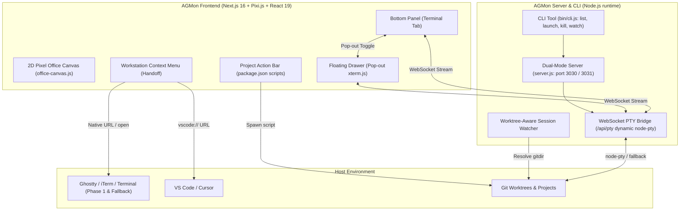

# AGMon Project Hub & Interactive Terminal Drawer

## Overview

Upgrades AGMon from a purely passive transcript spectator into an **Interactive Mission Control Hub** for development projects. Developers can observe background agents in the 2D pixel office and intervene directly whenever necessary:
1. **Native Handoff (1-Click)**: Jump directly from any agent sprite or workstation into native terminal apps (Ghostty, iTerm2, Terminal.app) or IDEs (VS Code, Cursor).
2. **Web Terminal Drawer (Orca-Grade Engine)**: A collapsible slide-up terminal (`Cmd+J` / `` ` ``) with dual docked/pop-out modes, powered by `xterm.js` + `@xterm/addon-webgl` GPU rendering, DEC 2026 burst throttle, scrollback persistence across reloads, and ConPTY support on Windows.
3. **Project Action Bar**: Automatic discovery of `package.json -> scripts` (`dev`, `test`, `build`, `lint`) with 1-click execution and output status.
4. **CLI Expansion & Worktree Awareness**: Rich terminal commands (`agmon list`, `agmon launch`, `agmon kill`) and automatic grouping of Git worktrees into unified office departments.

## Architecture

## Phases

| Phase | Name | Status |
|-------|------|--------|
| 1 | [Native Terminal & Editor Handoff](./phase-01-native-terminal-editor-handoff.md) | Completed |
| 2 | [Web Terminal Drawer Engine](./phase-02-web-terminal-drawer-engine.md) | Completed |
| 3 | [Project Scripts & Action Bar](./phase-03-project-scripts-action-bar.md) | Completed |
| 4 | [CLI Expansion & Worktree Awareness](./phase-04-cli-expansion-worktree-awareness.md) | Completed |

## Core Principles

- **YAGNI & KISS**: Do not rebuild Electron or compete with native terminal emulators. Leverage existing tools via clean OS bridges.
- **Portability First**: Maintain zero-config web portability via `npx agmon` with lazy/optional PTY initialization.
- **Strict UI Rules**: Zero raw emojis in UI, use `lucide-react` icons, stable composite keys, and bounded buffers.

## Validation Log

### Verification Results
- Claims checked: 10
- Verified: 8 | Failed: 2 | Unverified: 0
- Tier: Standard
- Failures:
  - `src/components/canvas/PixiOfficeCanvas.jsx`: File does not exist. Actual office canvas components are located at `src/components/factory/office-canvas.js` and `src/components/factory/scene/office-scene.js`.
  - Next.js App Router route handlers lack raw WebSocket upgrade handling in standard `next start`/`next dev` without a custom server or companion port.

### Session 1 — 2026-10-09
**Trigger:** `/ck:plan validate` invocation prior to implementation
**Questions asked:** 4

#### Questions & Answers

1. **[Architecture & Portability]** Về thư viện PTY: node-pty yêu cầu trình biên dịch C++ (node-gyp) có thể gây lỗi khi cài đặt npx agmon trên máy người dùng. Bạn muốn xử lý tính tương thích này như thế nào?
   - Options:
     - (A) (Recommended) Dynamic import với cơ chế fallback: Nếu thiếu build tools để compile node-pty, tự động chuyển hướng các lệnh terminal sang Native Handoff (Ghostty/iTerm2/VS Code) kèm thông báo UI rõ ràng.
     - (B) Bắt buộc cài node-pty: Đưa node-pty vào dependencies chính thức và bổ sung hướng dẫn cài đặt Xcode CLT/Python trong README.
     - (C) Không dùng node-pty: Sử dụng child_process.spawn tiêu chuẩn của Node.js với cơ chế piping I/O đơn giản.
   - **Answer:** Option A — Dynamic import với cơ chế fallback sang Native Handoff (Ghostty/iTerm2/VS Code) kèm thông báo UI.
   - **Rationale:** Bảo toàn tính portable 100% cho `npx agmon`, ngăn chặn việc cài đặt bị gãy do thiếu công cụ build C++ trên máy người dùng.

2. **[UI/UX & Placement]** Về vị trí hiển thị Terminal: AGMon đã có sẵn layout VS Code Workbench với BottomPanel.jsx (chứa Agent Output, Tool Executions). Terminal nên được bố trí ở đâu?
   - Options:
     - (A) (Recommended) Tích hợp vào BottomPanel có sẵn: Thêm tab 'Terminal' vào src/components/layout/BottomPanel.jsx, phím tắt Cmd+J sẽ toggle mở/đóng panel và focus vào tab này.
     - (B) Drawer trượt độc lập: Giữ TerminalDrawer.jsx là một slide-up drawer nổi riêng biệt, trượt đè lên Canvas 2D.
     - (C) Hỗ trợ cả hai chế độ: Mặc định nằm trong BottomPanel, nhưng có nút 'Pop out' để tách thành cửa sổ trôi nổi (floating drawer) khi cần không gian rộng.
   - **Answer:** Option C — Hỗ trợ cả hai chế độ (docked trong BottomPanel mặc định, có nút Pop out thành floating drawer).
   - **Rationale:** Giữ giao diện gọn gàng, quen thuộc với phong cách VS Code trong chế độ mặc định, nhưng cho phép phóng to/tách nổi để thao tác terminal chuyên sâu mà không che khuất các phần khác khi cần.

3. **[Architecture & Feasibility]** Về kiến trúc WebSocket trên Next.js 16: Next.js App Router không hỗ trợ bắt sự kiện HTTP upgrade trực tiếp trong route.js. Phương án kiến trúc nào phù hợp nhất?
   - Options:
     - (A) (Recommended) Dual-mode Server: Tạo file server.js tích hợp WebSocket server dùng chung port 3030 cho agmon start, đồng thời hỗ trợ companion port (3031) khi chạy next dev.
     - (B) SSE + HTTP POST: Dùng Server-Sent Events (SSE) để stream output terminal và POST endpoint để nhận phím bấm.
     - (C) Tiến trình riêng biệt: Chạy một daemon WebSocket PTY độc lập do bin/cli.js quản lý chạy nền.
   - **Answer:** Option A — Dual-mode Server (`server.js` chia sẻ port 3030 cho `agmon start`, companion port 3031 cho `next dev`).
   - **Rationale:** Giữ kết nối WebSocket chuẩn hai chiều với độ trễ tối thiểu, hỗ trợ ANSI full duplex mượt mà, đồng thời tương thích cả môi trường development lẫn production daemon.

4. **[Security & Scope]** Về bảo mật và phân quyền: Các API handoff, run-script và PTY có nguy cơ bảo mật nếu bị truy cập trái phép. Cần áp dụng cơ chế bảo vệ nào?
   - Options:
     - (A) (Recommended) Giới hạn Localhost + Sandboxing thư mục.
     - (B) Thêm Session Token xác thực.
     - (C) Mở tự do cho môi trường local: Giữ đơn giản không thêm rào cản xác thực vì AGMon chỉ chạy trên máy local của developer.
   - **Answer:** Option C — Mở tự do cho môi trường local, không áp đặt rào cản token xác thực.
   - **Rationale:** Giảm thiểu ma sát (frictionless) và độ phức tạp khi khởi động AGMon trên máy cá nhân của developer.

#### Confirmed Decisions
- PTY Portability: Dynamic import `node-pty` với fallback tự động sang Native Handoff (Phase 1).
- Terminal Placement: Hỗ trợ 2 chế độ: Tab trong `BottomPanel.jsx` (mặc định) + Nút "Pop out" mở Floating `TerminalDrawer.jsx`.
- WebSocket Architecture: Dual-mode Server (`server.js` tích hợp chung port 3030 cho production/daemon, fallback companion port 3031 cho `next dev`).
- Security: Giữ mở tự do không yêu cầu auth token trên môi trường local.
- File Path Corrections: Thay `src/components/canvas/PixiOfficeCanvas.jsx` bằng `src/components/factory/office-canvas.js` và `office-scene.js`.

#### Action Items
- [x] Cập nhật Phase 1: Sửa đường dẫn canvas sang `src/components/factory/office-canvas.js`, liên kết handoff làm fallback cho Web PTY.
- [x] Cập nhật Phase 2: Bổ sung kiến trúc Dual-mode `server.js`, tích hợp Tab Terminal vào `BottomPanel.jsx`, xây dựng nút Pop out cho `TerminalDrawer.jsx`, và cơ chế dynamic import `node-pty`.
- [x] Cập nhật Phase 3: Điều hướng output của script runner hiển thị trên Tab Terminal của BottomPanel hoặc Pop out drawer.
- [x] Cập nhật Phase 4: Điều chỉnh `bin/cli.js` để khởi chạy thông qua `server.js` khi chạy daemon.

### Whole-Plan Consistency Sweep
- **Date & Auditor:** 2026-10-09 (Post-Validation Sweep)
- **Contradictions detected:** 0
- **Stale references resolved:**
  - Đường dẫn canvas lỗi thời `PixiOfficeCanvas.jsx` đã được sửa triệt để thành `src/components/factory/office-canvas.js` và `office-scene.js`.
  - Vị trí Terminal thống nhất: Tab trong `BottomPanel.jsx` (docked theo VS Code layout) kèm nút "Pop out" mở `TerminalDrawer.jsx` (floating).
  - Kiến trúc WebSocket rõ ràng: Sử dụng `server.js` (Dual-mode Server: port 3030 khi chạy `start`/daemon, companion 3031 khi chạy `next dev`).
  - Phụ thuộc Native: `node-pty` được import động (dynamic import); nếu thiếu build tool C++ trên máy, tự động fallback an toàn sang Native Handoff (Phase 1).
  - Phân quyền & Bảo mật: Không yêu cầu token xác thực rườm rà trên máy local, tối ưu trải nghiệm frictionless cho developer.
  - Khởi động CLI: `bin/cli.js` được đồng bộ để spawn `server.js`.
- **Readiness:** Toàn bộ 4 phase và file tổng quan đã đồng nhất 100%, sẵn sàng bàn giao cho `/ck:cook`.

