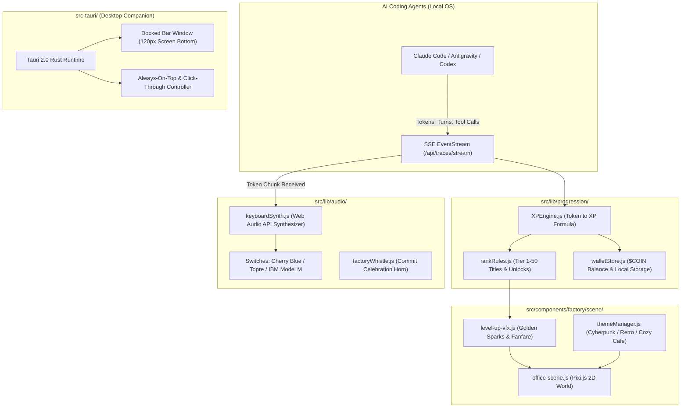

# AGMon AI Factory: Gamified Worker Progression, Cosmetics Store & Desktop Companion

## Overview

Upgrades AGMon from a monitoring dashboard into an **addictive, delightful AI Factory and monetizable desktop companion**. Inspired by the multi-million-dollar successes of *Rusty's Retirement* ($3.5M+) and *Spirit City: Lofi Sessions* ($5.3M+), this roadmap capitalizes on AGMon's unique unfair advantage: **Real-Work Mining**. Rather than idle simulation games where progress is arbitrary, AGMon's pixel workers gain XP and level up based on **actual code written, tokens consumed, and git commits completed** by Claude Code, Antigravity, and OpenAI Codex.

Key deliverables:
1. **Real-Work Progression Engine**: XP mining from actual CLI tokens/turns, 50-tier worker ranks (Intern $\rightarrow$ Automation Archmage), $COIN economy, and canvas level-up fanfare.
2. **Token-Cadence Mechanical Keyboard Synthesizer**: Web Audio API-powered realistic typing sounds (Cherry MX Blue, Topre, IBM Model M) that click at the exact live streaming rate of the LLM.
3. **Cosmetics & Theme Storefront**: Swappable factory environments (*Cyberpunk Neo-Tokyo*, *Silicon Valley 1984*, *Rainy Tokyo Cafe*), character skins, and dual monetization (free $COIN rewards + $2.99 - $9.99 Supporter Packs via VietQR & Stripe).
4. **Tauri Desktop Companion**: Standalone native desktop app (< 15MB) with **Docked Mode** (snapping to the bottom of the monitor like *Rusty's Retirement*) for all-day coding companionship.

---

## Architecture

---

## Phases

| Phase | Name | Description | Status |
|---|---|---|---|
| 1 | [Worker Progression & Real-Work XP Engine](./phase-01-worker-progression-real-work-xp-engine.md) | Token-to-XP formulas, worker ranks, $COIN local wallet, level-up canvas celebration | Pending |
| 2 | [Mechanical Keyboard Audio Synthesizer](./phase-02-mechanical-keyboard-audio-synthesizer.md) | Web Audio synthesizer for mechanical key clicks synced to streaming tokens, factory horn | Pending |
| 3 | [Factory Storefront & Cosmetic Themes](./phase-03-factory-storefront-cosmetic-themes.md) | Theme switcher (Cyberpunk/Retro/Rainy Cafe), character skins, VietQR/Stripe Supporter Store | Pending |
| 4 | [Tauri Desktop Companion Packaging](./phase-04-tauri-desktop-companion-packaging.md) | Tauri 2.0 bundle, Docked Bar mode at screen bottom, native notification triggers | Pending |

---

## Revenue Projections & Unit Economics

| Channel | Target Price | Est. Conversion | Projected Net Per 1,000 Users |
|---|---|---|---|
| **Free Open Source CLI** | $0 | 100% | Top of funnel & viral adoption |
| **Desktop Standalone App (Steam/Gumroad)** | $9.99 | 5% - 8% | $450 - $720 (Lifetime license) |
| **Theme & Sound DLC Packs** | $2.99 - $4.99 | 10% - 15% | $300 - $600 (Attach rate) |
| **Founder All-In-One Pack** | $24.99 | 2% - 3% | $500 - $750 |
| **Total Target** | — | — | **$1,250 - $2,070 / 1,000 active developers** |

---

## Non-Negotiable Constraints
- **Zero Heavy Audio Files**: All mechanical keyboard clicks and factory horns synthesized in realtime via Web Audio API (0MB network payload).
- **Offline & Local-First**: XP, levels, and unlocked themes stored in `localStorage` / encrypted local config with offline signature keys.
- **Strict UI Cleanliness**: Maintain zero raw emoji policy (`AGENTS.md`), use `lucide-react` icons and pixel sprite art exclusively.
